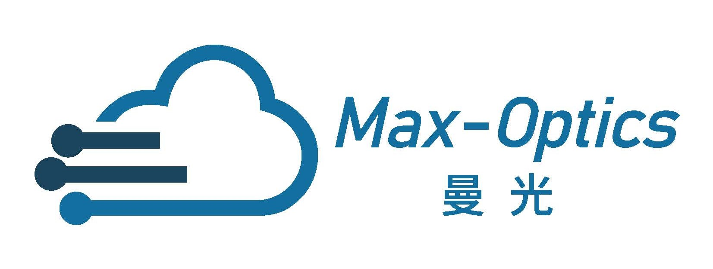

# Waht is Max-Optics?

## 公司简介：
上海曼光信息科技有限公司，成立于2018年8月。公司依托山东大学科研团队力量，凭借坚实的电磁场仿真与分析理论与技术基础，以及完备的自动化设备设计与制造、软件设计与开发能力研发出覆盖微波及光学频段的电磁场可视化软硬件产品，为客户提供完善的电磁场相关的仿真、设计、分析、测量解决方案。

公司业务面向5G、光通信、光电传感、光计算、工业物联网、国防安全等领域，主要涵盖电磁场仿真与测量两大业务。电磁仿真业务主要产品包括无源/有源光电芯片及系统仿真设计软件、光电芯片仿真设计服务、微波/射频天线仿真设计服务。电磁场测量业务光电子器件测量与参数提取平台；微波毫米波测量业务主要产品包括5G NR OTA测试系统、平面/柱面/球面近远场天线测试系统；公司以客户为中心，从客户直接需求出发，完成涵盖自动化测量设备软硬件定制化设计、制造、开发、交付的交钥匙工程，并提供电磁场相关设计与测量分析增值服务。

## Company Profile:

Shanghai Max-Optics Information Technology Co.,Ltd was established in August 2018. With the support of the research team from Shandong University, the company has developed electromagnetic field visualization software and hardware products covering microwave and optical frequency bands, based on solid electromagnetic field simulation and analysis theory and technology foundation, as well as comprehensive capabilities in automated equipment design and manufacturing, software design and development. These products provide customers with comprehensive solutions for electromagnetic field simulation, design, analysis, and measurement.

The company's business focuses on 5G, optical communication, optoelectronic sensing, optical computing, industrial IoT, and defense security. It mainly covers two major businesses: electromagnetic field simulation and measurement. The electromagnetic simulation business includes simulation design software for passive/active optoelectronic chips and systems, optoelectronic chip simulation design services, and microwave/radio frequency antenna simulation design services. The electromagnetic field measurement business includes optoelectronic device measurement and parameter extraction platforms. The microwave millimeter wave measurement business mainly includes 5G NR OTA testing systems, planar/cylindrical/spherical near-field and far-field antenna testing systems. The company is customer-oriented, starting from the direct needs of customers, and completes turnkey projects that cover customized design, manufacturing, development, and delivery of automated measurement equipment hardware and software. It also provides value-added services for electromagnetic field design and measurement analysis.

<<<<<<< HEAD
这是一个行内公式： <InlineMath math="E=mc^2" />

这是一个块级公式：

<BlockMath math="\sum_{i=1}^{n} i = \frac{n(n+1)}{2}" />
=======
<!-- | 曼光     | 曼光     | 曼光科技     |
| ------- | ------- | ------- |
| 单元格1 | 单元格2 | 单元格3 |
| 单元格4 | 单元格5 | 单元格6 |
 -->
>>>>>>> parent of 0aace96b6 (增加了react-katex组件用以支持latex公式)
