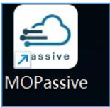
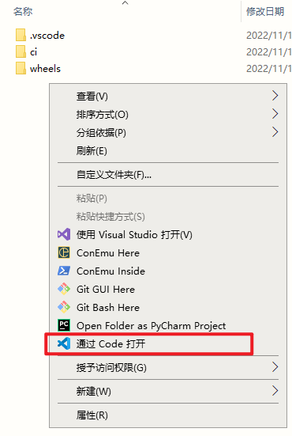
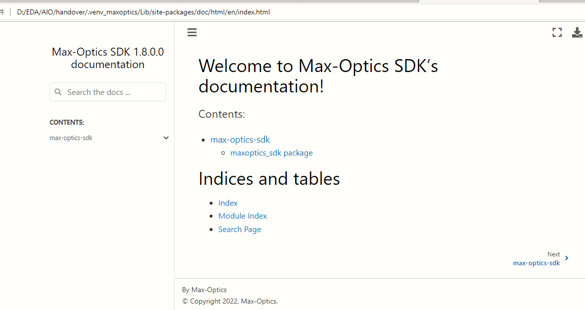
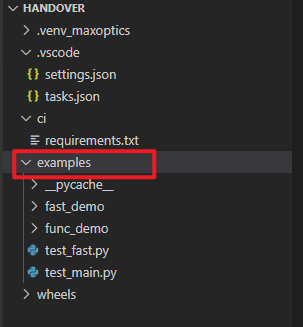
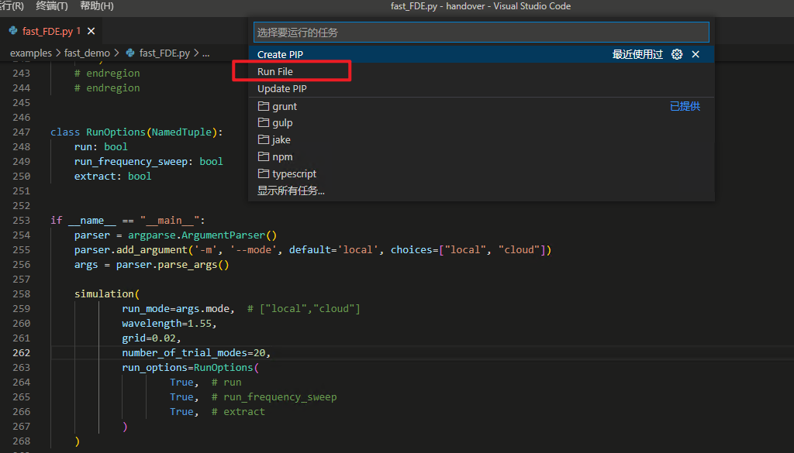

# 1. How to install Max-Optics GUI

Max-Optics Studio Local Passive Software Installation

## 1) Open the Installation Package

Find the Setup.exe package, double-click to open the MOPassive-x.x.x.x+build.xxxxxxxx-setup
installation package.


If there is a pop-up window come out, please press the “Run” button and wait to run.


Check the contents and click "I Accept The Agreement" item, then click "Next".


## 2) Select Destination Location

User can custom destination location by pressing “Browse...” button , or just use the auto-default
location, then press the “Next” button.


## 3) Select Start Menu Folder & Create a Shortcut

In the "Select Start Menu Folder" window, users can either click the "Next" button directly or
customize the location for shortcuts by clicking the "Browse..." button.


In the "Select Additional Tasks" window, users can choose to create a desktop shortcut by selecting
the "Create a desktop shortcut" option, and then proceed by clicking the "Next" button. Alternatively,
users can simply uncheck the option and click the "Next" button directly.


## 4) Ready to Install

In the "Ready to Install" window, click the "Install" button to proceed with the installation.


## 5) Installing

Please wait, until installation is complete.


## 6) Restart

Check either the “yes, restart the computer now” or “No, I will restart the computer later” to invoke
the software. Then press “Finish” button.


## 7) Complete

Once the installation is complete, the user can find a shortcut to the software on their desktop.



##  Notes:
User can double click the shortcut to invoke the software;

User also can double click a .passive file to open the software automatically

# 2. How to install Max-Optics Python SDK

## 1) Python Environment Prepare

通过以下命令, 确保本地环境`Python`版本为`3.8.x`

```py
python --version
```

## 2) Copy handover

目录结构如下

```
├─.vscode
│      settings.json
│      tasks.json
│
├─ci
│      requirements.txt
│
└─wheels
        aiohttp-3.8.3-cp38-cp38-win_amd64.whl
        aiosignal-1.3.1-py3-none-any.whl
        async_timeout-4.0.2-py3-none-any.whl
        attrs-22.1.0-py2.py3-none-any.whl
        bidict-0.22.0-py3-none-any.whl
        cairocffi-1.4.0.tar.gz
        CairoSVG-2.5.2-py3-none-any.whl
        certifi-2022.9.24-py3-none-any.whl
        cffi-1.15.1-cp38-cp38-win_amd64.whl
        charset_normalizer-2.0.12-py3-none-any.whl
        colorama-0.4.6-py2.py3-none-any.whl
        contourpy-1.0.6-cp38-cp38-win_amd64.whl
        cssselect2-0.7.0-py3-none-any.whl
        cycler-0.11.0-py3-none-any.whl
        defusedxml-0.7.1-py2.py3-none-any.whl
        drawSvg-1.8.3-py3-none-any.whl
        fonttools-4.38.0-py3-none-any.whl
        frozenlist-1.3.3-cp38-cp38-win_amd64.whl
        gdspy-1.6.12-cp38-cp38-win_amd64.whl
        idna-3.4-py3-none-any.whl
        imageio-2.22.4-py3-none-any.whl
        kiwisolver-1.4.4-cp38-cp38-win_amd64.whl
        matplotlib-3.6.2-cp38-cp38-win_amd64.whl
        max_optics_local_sdk-1.4.0.xxxx.xxxx-cp38-cp38-win_amd64.whl
        max_optics_sdk-1.9.0.0.xxxx.xxxx-py3-none-any.whl
        max_optics_whale-1.2.0.xxxx.xxxx-cp38-cp38-win_amd64.whl
        multidict-6.0.2-cp38-cp38-win_amd64.whl
        numpy-1.22.4-cp38-cp38-win_amd64.whl
        packaging-21.3-py3-none-any.whl
        pandas-1.4.2-cp38-cp38-win_amd64.whl
        Pillow-9.1.1-cp38-cp38-win_amd64.whl
        pycairo-1.21.0-cp38-cp38-win_amd64.whl
        pycparser-2.21-py2.py3-none-any.whl
        pyparsing-3.0.9-py3-none-any.whl
        python_dateutil-2.8.2-py2.py3-none-any.whl
        python_engineio-4.3.4-py3-none-any.whl
        python_socketio-5.6.0-py3-none-any.whl
        pytz-2022.6-py2.py3-none-any.whl
        PyYAML-6.0-cp38-cp38-win_amd64.whl
        requests-2.27.1-py2.py3-none-any.whl
        scipy-1.8.1-cp38-cp38-win_amd64.whl
        seaborn-0.11.2-py3-none-any.whl
        setuptools-65.5.1-py3-none-any.whl
        setuptools_scm-7.0.5-py3-none-any.whl
        six-1.16.0-py2.py3-none-any.whl
        tinycss2-1.2.1-py3-none-any.whl
        toml-0.10.2-py2.py3-none-any.whl
        tomli-2.0.1-py3-none-any.whl
        typing_extensions-4.4.0-py3-none-any.whl
        urllib3-1.26.12-py2.py3-none-any.whl
        webencodings-0.5.1-py2.py3-none-any.whl
        yarl-1.8.1-cp38-cp38-win_amd64.whl
        zipfile36-0.1.3-py3-none-any.whl
```

其中:

`.vscode`为支持`VSCode`中运行任务所需的配置文件

`ci`中的`requirements.txt`为安装`AIO`所需的依赖及版本信息

`wheels`为安装`AIO`所需的所有所有依赖

## 3) Check/Modify settings.json config of VSCode

`python.defaultInterpreterPath`为本地环境中的`python`运行时地址, 请根据本地环境确认或修改

`python.findLinkFrom`为安装依赖包的路径, 无需修改

`python.analysis.typeCheckingMode`为是否开启类型开关, 默认为`basic`

## 4) Open handover directory




## 5) Create PIP

若为首次安装, 即未创建`Python`虚拟环境, 则通过`Create PIP`任务进行创建


VSCode会自动打开终端进行AIO SDK的安装, 安装结束后, 按任意键退出


## 6) Update PIP

若收到新的安装文件, 则将安装文件`xxx.whl`保存至`wheels`文件夹, 同时修改`requirements.txt`中的版本, 然后执行`VSCode`的`Update PIP`任务


## 7) handbook

在`VSCode`中打开一个终端, 此时会激活`.venv_maxoptics`虚拟环境, 通过输入如下命令可进行手册查看

```py
mo.sdk doc
```




## 8) Copy examples
   
在`VSCode`中打开一个终端, 此时会激活`.venv_maxoptics`虚拟环境, 通过输入如下命令可进行`examples`拷贝

```py
mo.sdk init -n examples
```

其中, `-n`为要拷贝的目标文件夹名称


此时, 会在handover文件夹下创建一份名为examples的脚本样例



## 9) Run File

打开脚本样例中的一个`py`文件, 在终端中运行`Run File`任务可执行脚本



## 10) MaxOptics License Instruction

授权设置终端 [MaxOptics SDK__SetLocalServer.exe](../../MaxOpticsSDK__SetLocalServer.exe)


