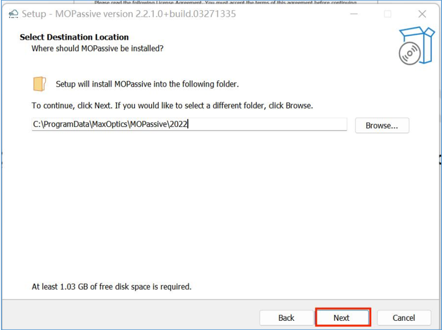

# 1. How to install Max-Optics GUI

Max-Optics Studio Local Passive Software Installation

## 1) Open the Installation Package

Find the Setup.exe package, double-click to open the MOPassive-x.x.x.x+build.xxxxxxxx-setup
installation package.

If there is a pop-up window come out, please press the “Run” button and wait to run.

Check the contents and click "I Accept The Agreement" item, then click "Next".

## 2) Select Destination Location

User can custom destination location by pressing “Browse...” button , or just use the auto-default
location, then press the “Next” button.

## 3) Select Start Menu Folder & Create a Shortcut

In the "Select Start Menu Folder" window, users can either click the "Next" button directly or
customize the location for shortcuts by clicking the "Browse..." button.

In the "Select Additional Tasks" window, users can choose to create a desktop shortcut by selecting
the "Create a desktop shortcut" option, and then proceed by clicking the "Next" button. Alternatively,
users can simply uncheck the option and click the "Next" button directly.

## 4) Ready to Install

In the "Ready to Install" window, click the "Install" button to proceed with the installation.

## 5) Installing

Please wait, until installation is complete.

## 6) Restart

Check either the “yes, restart the computer now” or “No, I will restart the computer later” to invoke
the software. Then press “Finish” button.

## 7) Complete

Once the installation is complete, the user can find a shortcut to the software on their desktop.

##  Notes:
User can double click the shortcut to invoke the software;

User also can double click a .passive file to open the software automatically

