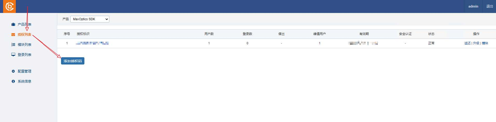
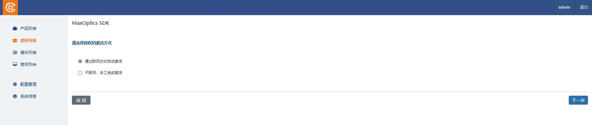
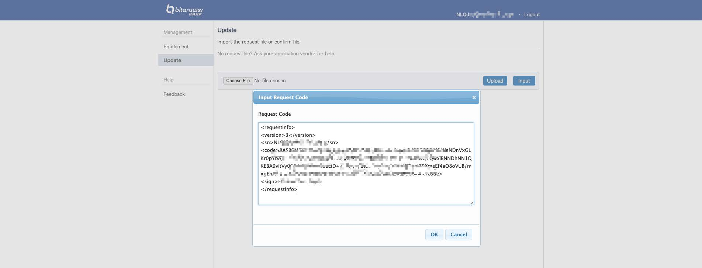
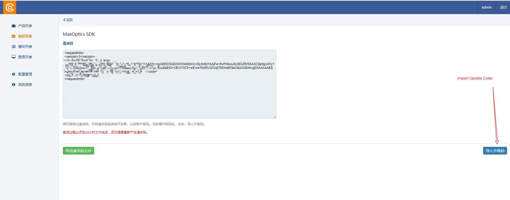
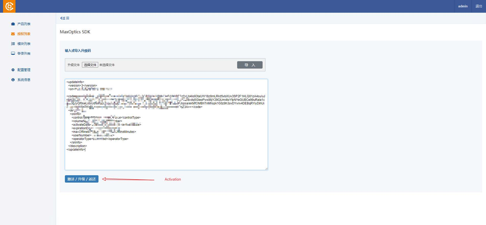
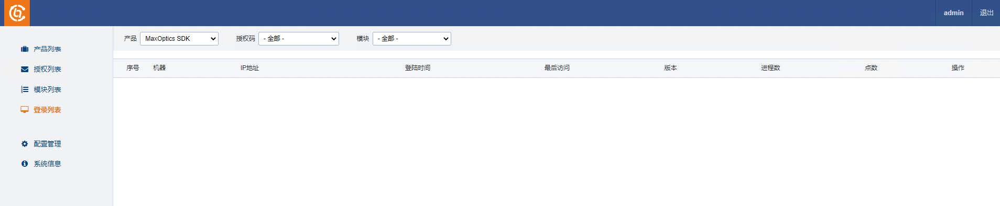

# Local SDK License Instructions
## **Server: Install Group Licensing Local Service**

### 1. Unzip the Release Packages
Local Service Installer: `bit_service.exe`

    Group licensing local service.
Extension Module: `MaxOptics SDK_.ext`

    The group licensing product extension module. 
    Users should install the Extension along with the Local Service Installer to support the product.
    
Group Licensing Setting Tools: `MaxOptics SDK__SetLocalServer.exe`
    
    The client queries/sets the group server address and port.

### 2. Installation & Activation


1. Double click `bit_service.exe` for the installation;

2. Open http://localhost:8274/manager/product.html ;

3. Add Extension Module;

    

4. Activate the license online [Support online and offline];

    
    

5. Search License Info via the Given URL, then enter the License Code on the User Login Page.

    

## Activation Offline

1. Choose `Activation Offline`

    

2. Enter your `Authorization Code` to generate the `Request Code`

    

3. Copy or Export `Request Code`

    

4. Open a tab with https://user.bitanswer.cn, enter your `Authorization Code`

5. Generate Update Code

    
    
    

6. Copy or Download Update Code, and Import your Update Code

    
    

### Module List: All License Code Features would be listed here

e.g.


### Login List: All current running client machines using the license service would be listed here 
e.g.



## Client: Configuration

### Configure the Group Licensing Service IP

On the client machine, running `MaxOptics SDK__SetLocalServer.exe` to configure
Group Licensing Local Service

It supports the two ways:

    Discovery Automatically
    Configure Manually

### Create the Local Config File

Create `.sdk` dir on the User HOME

    *nix: HOME is /home/<user>
    Windows: HOME is C:\Users\<user>

```
mkdir -p ~/.sdk/
touch ~/.sdk/config.yml # or ~/.sdk/config.yaml
# or
touch ~/.sdk/config.toml
```

### Configure Fields

Support YAML and TOML format, please refer to the following code snippets:

for YAML:

```
max_optics:
    is_group_auth: true
    sn: "<Authorization Code> if is_group_auth is false, else
delete this line"
    # the following block is only for group authorization
    group:
    host: "<group auth url>"
    port: "<group auth port>"
```

for TOML:

```
[max_optics]
is_group_auth = true
sn = "<Authorization Code> if is_group_auth is false, else delete
this line"
# the following block is only for group authorization
[max_optics.group]
host = "<group auth url>"
port = "<group auth port>"
```
