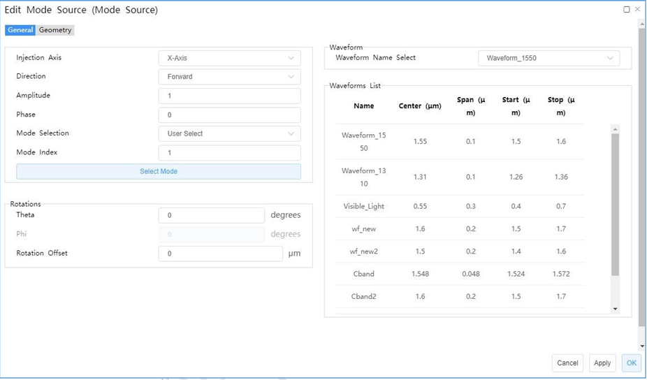
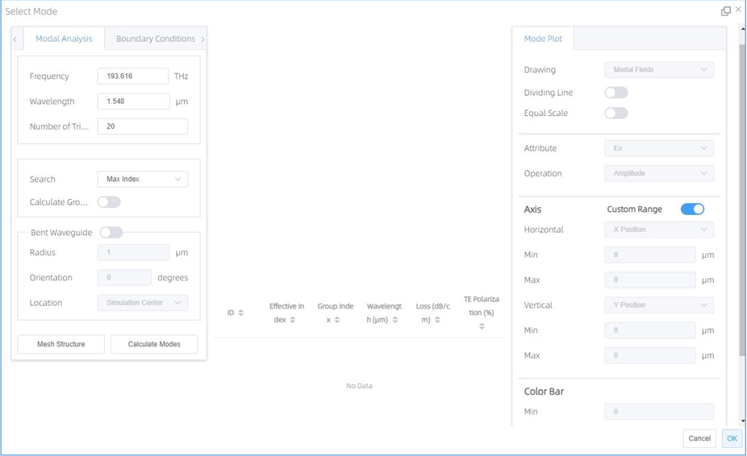
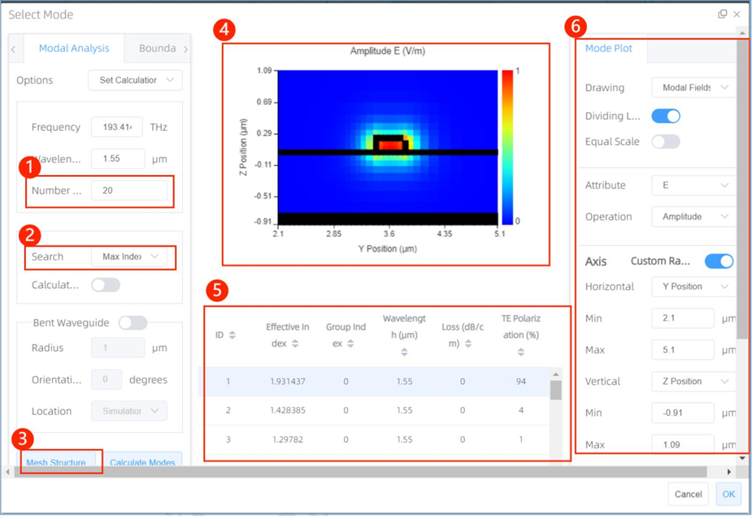
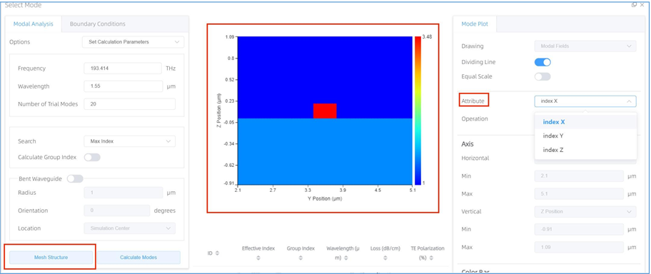
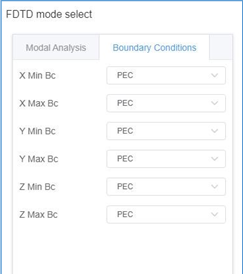
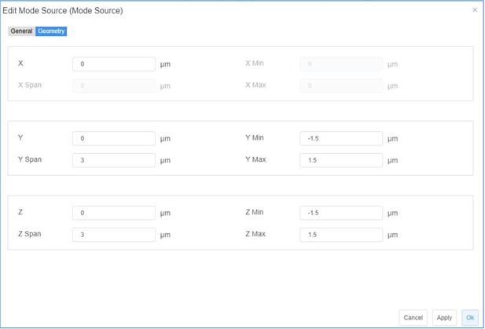
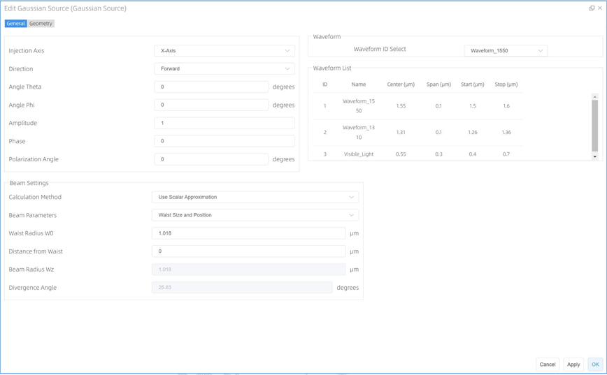
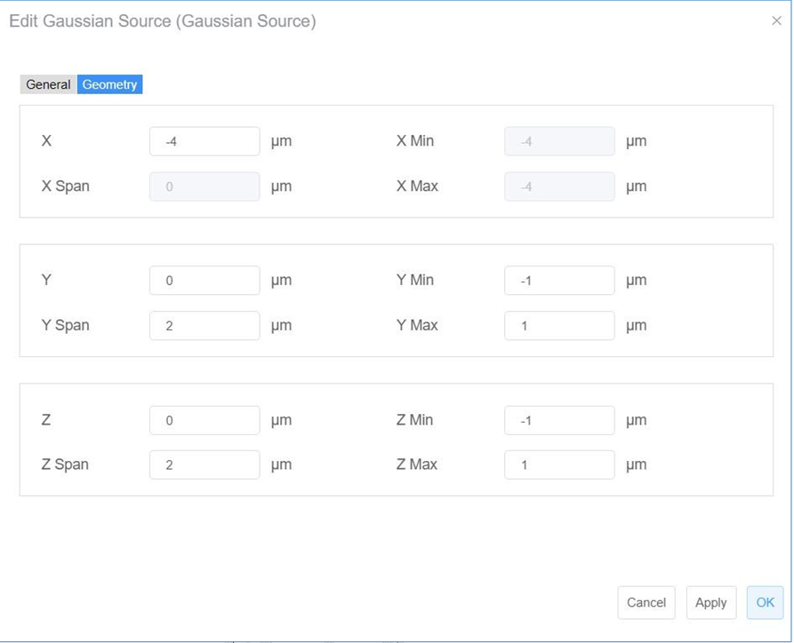

# Source

## Mode Source:
- **Feature Description:**
The mode source is used to inject a guided mode into the simulation region in FDTD. You could add and set mode source here.
- **General tab**

1 ) ***Injection Axis:*** This field specifies the axis for the mode source propagation. Three options are available: “***X-Axis***”, “***Y-Axis***”, and “***Z-Axis***”.

2 )	***Direction:*** This field indicates the direction of mode source propagation. Two options are available: “Forward” means the propagation is along a positive direction, while “Backward” means the propagation is along a negative direction.

3 )	***Amplitude:*** This field specifies the amplitude of the mode source. See the section ``Units and normalization section''. (Default value: 1)

4 ) ***Phase:*** This field refers to the phase value (in units of degrees) of the mode source. It makes sense only when there exist relative phase differences among multiple sources of radiation.

5 ) ***Rotations:***

-> ***Theta:*** This refers to the angle of propagation measured by degrees, with respect to the incident axis of the source in a 3D simulation. In a 2D simulation, it is the angle of propagation measured by degrees revolved around the global Z-axis in compliance with the right-hand rule, that is, the angle of propagation in the XY plane.

-> ***Phi:*** This refers to the angle of propagation measured by degrees revolved around the incident axis of the source in compliance with the right-hand rule in a 3D simulation. In a 2D simulation, this value does not take effect.

-> ***Rotation Offset:*** A rotation offset can be endowed to the plane upon which the mode is computed. This guarantees that mode sources at an angle do not interfere with structures not belonging to the waveguide/fiber.

6 ) ***Mode selection:*** Defines whether to inject fundamental mode or other user-selected modes chosen via the "Select Mode" button. Currently, mode selection options are “Fundamental Mode”, “Fundamental TE Mode”, “Fundamental TM Mode”, “User Select” and “User Import”.

**Works flow: User Select -> “Select Mode”** window:

- **Modal analysis tab:**

In this section you can set “Frequency”, “Wavelength”, “Number of Trial Modes”, “Search”, and also can set bent waveguide via selecting “Calculate Group Index” and “Bent Wave guide”.

1) **Number of Trial Modes:** This specifies the number of modes to search for a fundamental mode. The modes eventually found by the solver may depend on that. If one uses a too small number, the expected modes could be missing. Usually, setting this number to 100 suffices to guarantee no physical modes would have been missed. However, users who are interested in higher order modes should set an even larger value, since in such cases more than 100 modes may be present.

2) **Search:** The user can specify an index to search around or a range of indices to sweep for finding modes of interest. The specified value indicates the magnitude of the index (which is complex) rather than just its real part.

-> ***Max index:*** By checking this option, the FDTD calculation automatically admits the maximum index mode (Default: 1).

-> ***Near N:*** If unchecked, the user can set the value of N in the following box according to the need. 

If the selected value is not within the range of the mode index value, the nearest value from the user’s setting will be adopted instead for selecting the FDTD mode.

3) ***Mesh Structure:*** User can view structure and material information about mesh. When click the button, result view will be shown, and attribute drop-down list includes: Index X, Index Y, Index Z.

4) ***Plot area:*** The plot area where the simulation data is plotted.

5) ***Mode list:*** Mode list where the “ID”, “Effective Index”, “Group Index”, “Wavelength”, “Loss”, and “TE Polarization Fraction” are shown. How many modes will be shown, will according to the “Number of Trail Modes” setting.

6) ***Mode Plot options:*** The mode plot options are used to specify which data to plot in the plot window, also can be used to modify the current mode plot options.

7) ***Export:*** The export button supports users exporting the data file they are interested in.

***Notes:*** For detailed information please refer to Chapter 2.7.6.1.2.Mode Plot Window

- **Boundary conditions tab:** 

In this section, you can set mode source simulation region’s boundary conditions and six types can be chosen: PEC, PML, PMC, Symmetric, Periodic and Anti-Symmetric. (Default: PEC)
- **Geometry tab:** 

1) ***X，X Span/ Y, Y Span, Z/ Z span:*** The geometry tab contains options to change the size and location of the sources.

## Gaussian source：

- **Feature Description:** The gaussian source is used to inject a gaussian source into the simulation region in FDTD. You could add and set gaussian source here.

- **General tab:**

1) ***Injection Axis:*** This field specifies the axis for the gaussian source propagation. Three options are available: “X-Axis”, “Y-Axis”, and “Z-Axis”.

2) ***Direction:*** This field indicates the direction of gaussian source propagation. Two options are available: “Forward” means the propagation is along a positive direction, while “Backward” means the propagation is along a negative direction.

3)	***Angle Theta:*** This refers to the angle of propagation measured by degrees, with respect to the incident axis of the source in a 3D simulation. In a 2D simulation, it is the angle of propagation in degrees revolved around the global Z-axis in compliance with the right-hand rule, that is, the angle of propagation in the XY plane.

4)	***Angle Phi:*** For 3D simulations, Phi corresponds to the angle of propagation (measured by degrees) revolved around the axis of source injection in compliance with the right-hand rule. This value has no meaning for 2D simulations.

5)	***Amplitude:*** This field specifies the source amplitude. (Default value: 1)

6) ***Phase:*** This field refers to the phase value (in units of degrees) of the point source. It makes sense only when there exist relative phase differences among multiple sources of radiation.

7) ***Polarization Angle:*** For an injective electric field, the polarization angle is meant to be its orientation, measured with respect to the plane formed by the vector of propagating direction and the normal of the injection plane. Radiation with a vanishing polarization angle is P-polarized regardless of the direction of propagation, while radiation with a polarization angle of 90 degrees is S-polarized.

- **Waveform Tab:**
1) ***Waveform ID select:*** Allows you to choose the waveform id from a list of the existing waveforms. Three types options of for waveforms provided by default, which include Waveform_1550, Waveform_1310, and Visible_Light.

- **Waveform List:**
The waveform information of “ID”, “Name”, “Center”, “Span”, “Start” and “Stop” are included in waveform list.

- **Beam Settings Tab:**
1) ***Calculation Method:*** You can select “Use Scalar Approximation” or “Use Vector Approximation” for calculation. (Default: Use Scalar Approximation)

2) ***Beam Parameters:*** The user can choose either “Waist Size and Position” or “Beam Size and Divergence” to define a scalar beam. (Default: Waist Size and Position)

3) ***Waist Radius W0:*** The user can input the value of waist radius (measured by μm; Default: 1.01818) within the range [1e-30,1e30]. The setting Beam Parameters=”Waist Size and Position” enables the user to modify the value.

4) ***Distance From Waist:*** This distance is positive if the beam is divergent, or negative provided the beam is convergent. The setting Beam Parameters=”Waist Size and Position” enables the user to modify the value.

5) ***Beam Radius Wz:*** The user can input the value (measured by μm; Default: calculated value) within the range [1e-30,1e30]. The setting Beam Parameters=”Beam Size and Divergence” enables the user to modify the value.

6) ***Divergence Angle:*** This refers to the angle of radiation spreading into the far field as measured. Positive/Negative angles correspond to diverging/converging beams, respectively. The user can input the value within the range of (-90,90). The value can be editted if Beam Parameters=”Beam Size and Divergence”.

- **Geometry tab**

1) ***X，X Span/ Y, Y Span, Z/ Z span:*** The geometry tab contains options to change the size and location of the sources.
