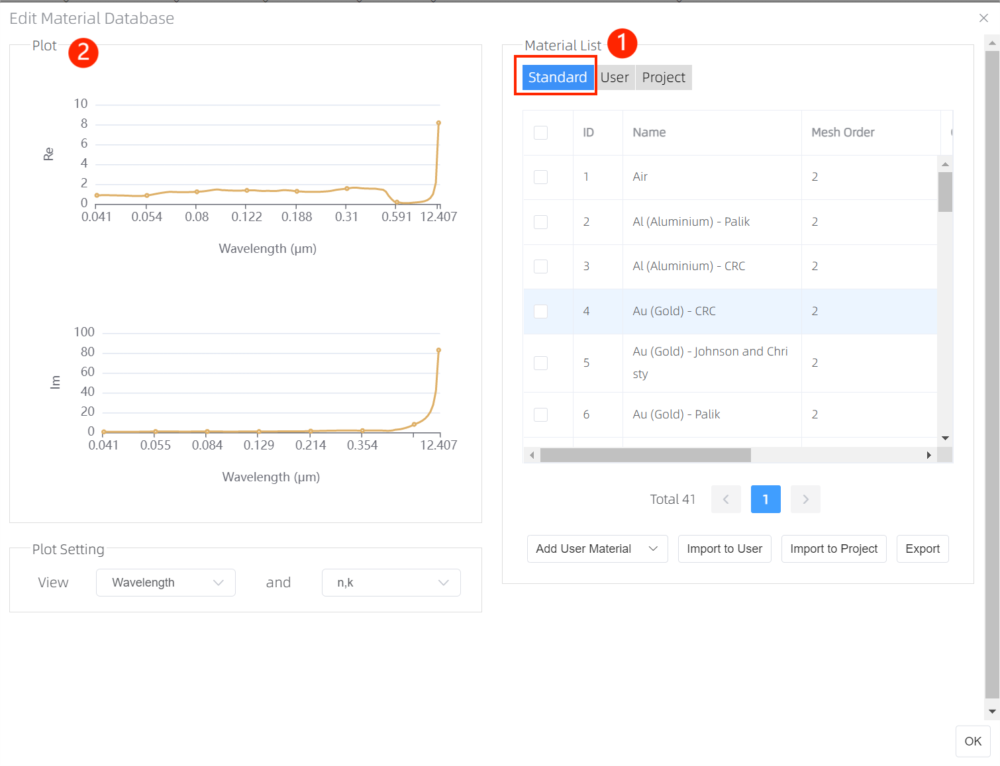
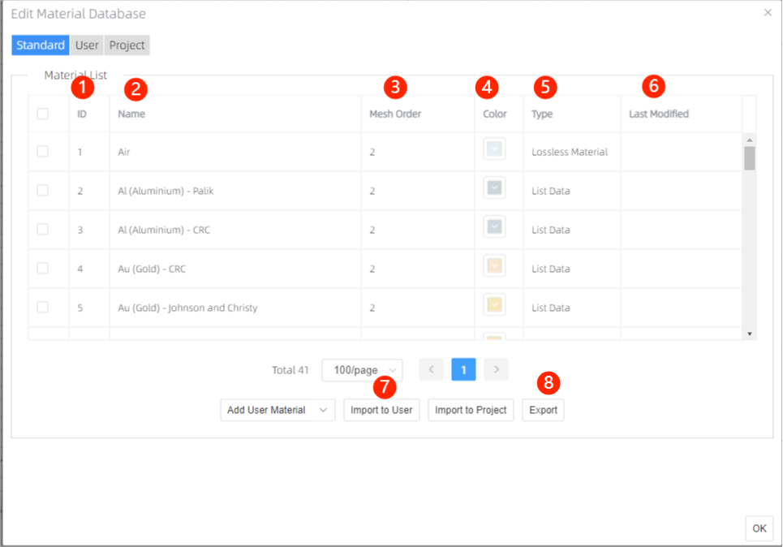
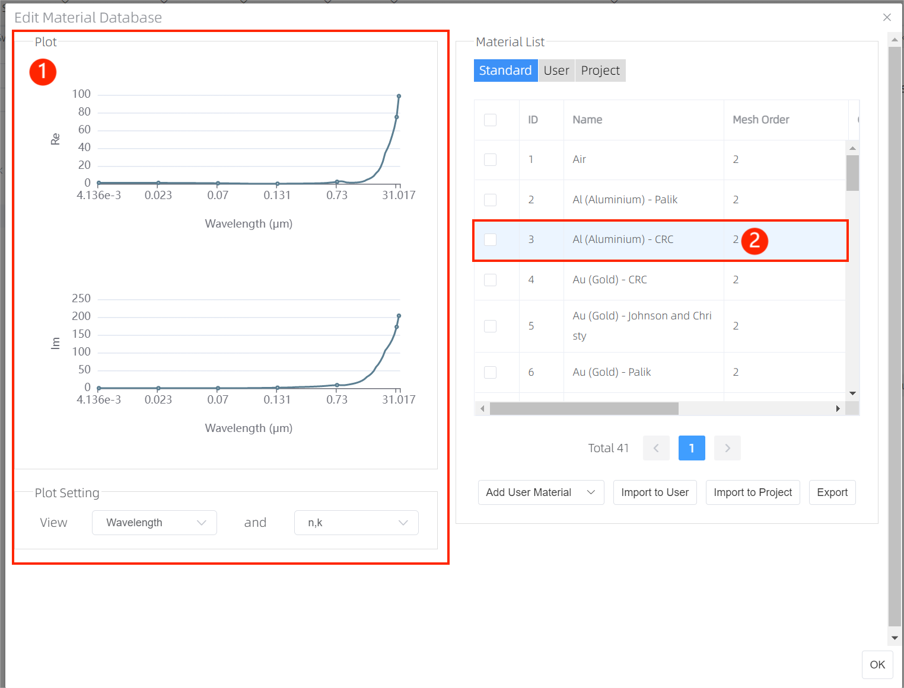
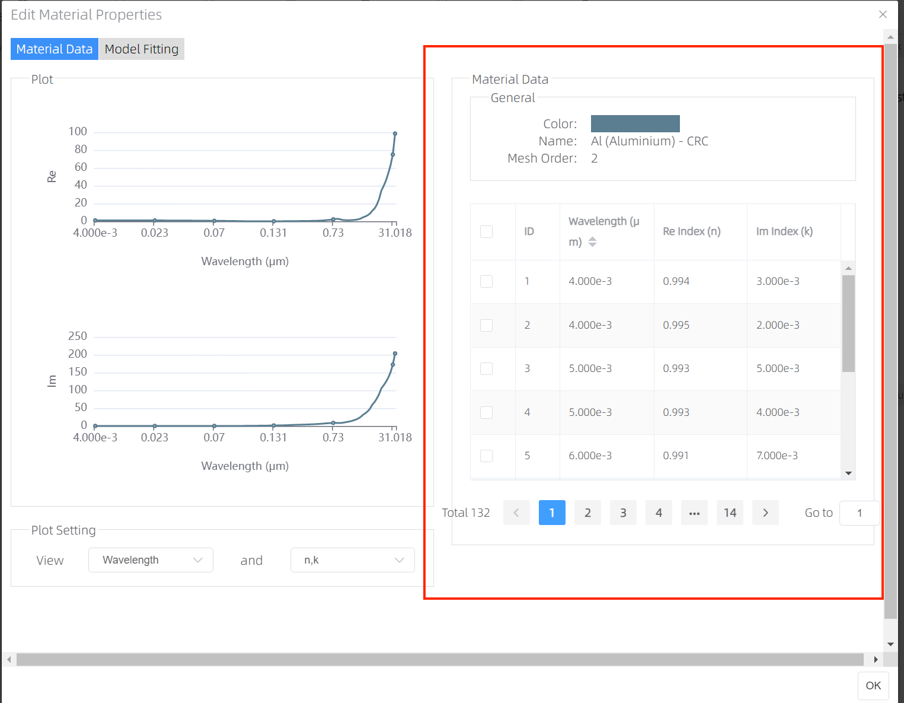
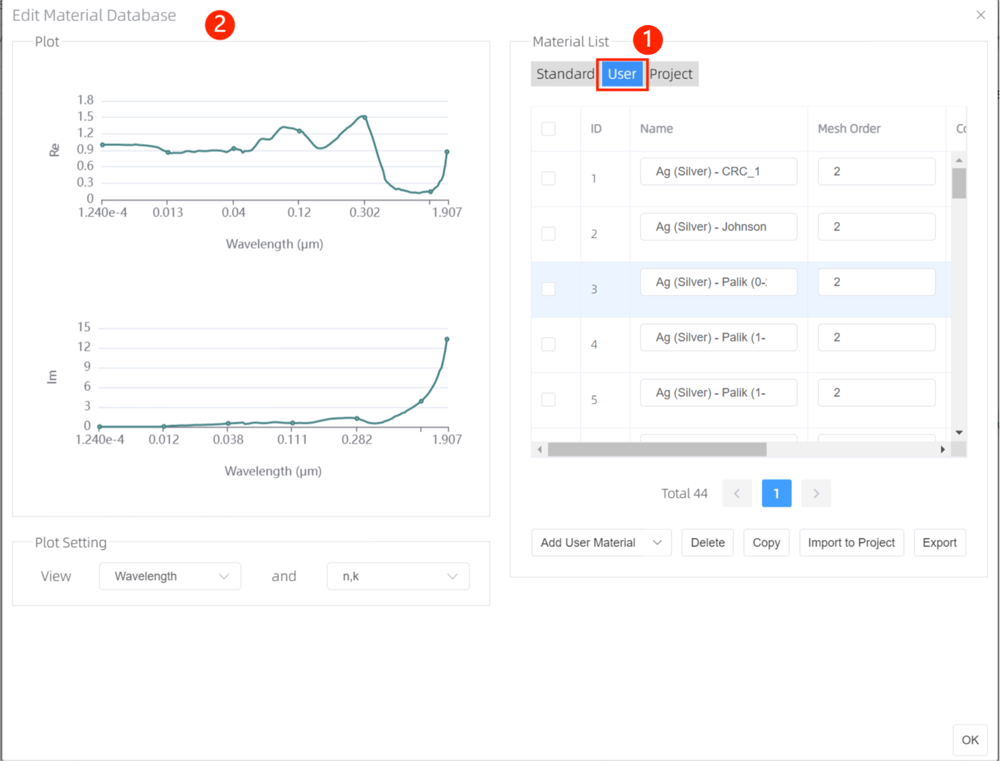

# Material

### Features Description: 

The Global Material Database allows for the definition of complex materials using experimental data or parameterized models. The Material Database stores the material data to be used in the simulation. It also provides an interface to change material properties like color, mesh order, and fit parameters. User could import materials from “Standard” database to “User” and “Project” material database, and also from “User” material database to “Project” material database.

###  Standard & User & Project Material Database:

Material database includes standard, user, and project material database.

## Standard Material Database

The standard material database includes two parts, one is material list, and another is material property plot. The material list includes a number of common materials, when creating a new simulation, the standard database will be loaded. And the materials in the standard material database can be imported into “User” and “Project” material database. The default materials cannot be edited directly. 

### Material List

1. __ID__ : ID
2. __Name__ : Material Name
3. __Mesh Oder__: Decides how overlapping objects are meshed in the simulation.
4. __Color__ : Material Color
5. __Type__ : Types of material, three types are included, there are Lossy material, Lossless material and List data as follows.
   1. __Lossy Material__ : Lossy Material
   2. __Lossless Material__ : Lossless Material (insulating material)
   3. __List Data__ : Materials whose dielectric permittivity changes with wavelength settings, displayed in tabular form.
6. __Last Modified__ :Last modified time
7. __Import__: Import materials to user or project database.
8. __Export__: Export materials according to user needs.

### Materials in the Standard Material Database
The following materials are included in the standard material database.

<code>
ID	Name	Mesh Order	Type
1	Air	2	Lossless Material 
2	Al (Aluminium) - Palik	2	List Data
3	Al (Aluminium) - CRC	2	List Data
4	Au (Gold) - CRC	2	List Data
5	Au (Gold) - Johnson and Christy	2	List Data
6	Au (Gold) - Palik	2	List Data
7	Ge (Germanium) - CRC	2	List Data
8	Ge (Germanium) - Palik	2	List Data
9	Si (Silicon) - Palik	2	List Data
10	SiO2 (Glass) - Palik	2	List Data
11	Si3N4 (Silicon Nitride) - Kischkat	2	List Data
12	Si3N4 (Silicon Nitride) - Phillip	2	List Data
13	Ag (Silver) - CRC	2	List Data
14	Pt (Platinum) - Palik	2	List Data
15	Ta (Tantalum) - CRC	2	List Data
16	TiN - Palik	2	List Data
17	Cu (Copper) - Palik	2	List Data
18	Fe (Iron) - CRC	2	List Data
19	W (Tungsten) - CRC	2	List Data
20	Ti (Titanium) - Palik	2	List Data
21	Ti (Titanium) - CRC	2	List Data
22	Sn (Tin) - Palik	2	List Data
23	H2O (Water) - Palik	2	List Data
24	Cr (Chromium) - CRC	2	List Data
25	Pd (Palladium) - Palik	2	List Data
26	InAs - Palik	2	List Data
27	Ag (Silver) - Palik (1-10um)	2	List Data
28	Ag (Silver) - Johnson and Christy	2	List Data
29	W (Tungsten) - Palik	2	List Data
30	Fe (Iron) - Palik	2	List Data
31	Cr (Chromium) - Palik	2	List Data
32	Al2O3 - Palik	2	List Data
33	In (Indium) - Palik	2	List Data
34	Cu (Copper) - CRC	2	List Data
35	Ni (Nickel) - CRC	2	List Data
36	V (Vanadium) - CRC	2	List Data
37	InP - Palik	2	List Data
38	GaAs - Palik	2	List Data
39	Ni (Nickel) - Palik	2	List Data
40	Rh (Rhodium) - Palik	2	List Data
41	Ag (Silver) - Palik (0-2um)	2	List Data
</code>

### Material Properties:

__Plot__ : User can view each material property in this plot area via clicking a certain material in material list, also can view properties they are interested in via two options in the bottom of plot. Material properties include “Color”, “Name”, “Mesh Order”, “Wavelength”, “Frequency”, “n,k”-Re(refractive index)&Im(refractive index), “εr′,εr″”-Re(relative permittivity)&Im(relative permittivity), ε’,σ-Re(relative permittivity)&Im(relative permittivity).

### 1)	Material Data & Model Fitting

Material Data tab: User can view each material property in this list via double clicking a certain material in material list. Material properties include “Color”, “Name”, “Mesh Order”, “Wavelength”, “Frequency”, “n,k”-Re(refractive index)&Im(refractive index), and “εr′,εr″”-Re(relative permittivity)&Im(relative permittivity).

1. 

2. Model Fitting: (Currently, the model fitting feature is not available and is still in the development process.)

## User Material Database

The User material database, a database that stores materials used by user. The user material database includes two parts, one is material list, and another is material property plot. User can copy or delete a selected material, The materials in the “User” material database can be imported to the “Project” material database. And users also can export materials according to their needs.

