# Monitor
---
sidebar_position: 2
---

## Index Monitor

- **Feature Description:** Index monitors store the values of n and k as functions of frequency/wavelength in a simulation. In future, the index monitor will also be able to record the temporal profiles of physical properties for nonlinear media.

- **Geometry tab:**

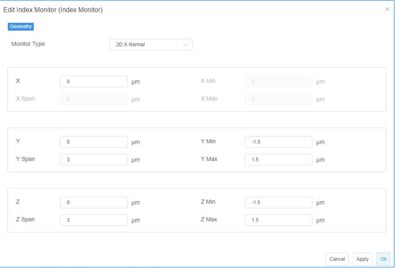

1) ***Monitor type:*** The monitor type and orientation, this option will control the availability of spatial settings below.

2) ***X, Y, Z:*** The center position of the simulation region.

3) ***X Min, X Max:*** X min, X max position.

4) ***Y Min, Y Max:*** Y min, Y max position.

5) ***Z Min, Z Max:*** Z min, Z max position.

6) ***X Span, Y Span, Z Span:*** X, Y, Z span of the simulation region.

7) ***Index Preview:*** allows user to run the index monitor individually via right-clicking the “Index Preview” menu in the object tree.

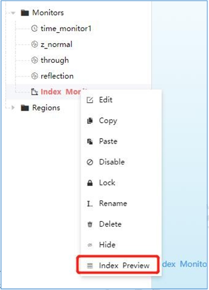

## Frequency-domain field and power monitor
- **Feature Description:**
Frequency domain field monitors work in the frequency domain and extract the field profiles across some spatial regions of the FDTD simulation.

- **Notes:**
Before adding the Frequency-domain field and power monitor, Mode Source must be added.

- **General tab:**

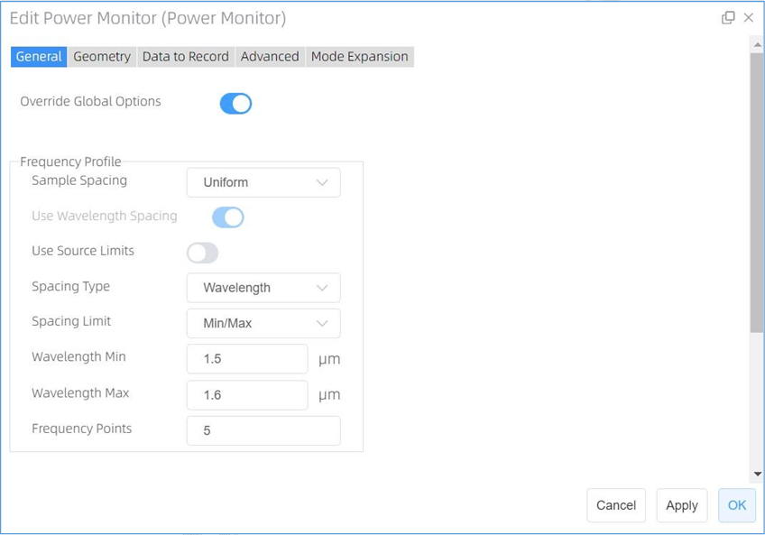

1 ) ***Override Global Options:*** This is a toggle for overriding the global monitor settings. Checking this option enables the user to specify the frequency spans and number of points at which frequency-domain data will be collected. Otherwise the following options should be specified from the global monitor settings.

2 ) ***Sample Spacing:*** The sampling frequency or wavelength is determined somehow based on this choice parameter. Only the "uniform" option is available at present.
 
3 ) ***Use Source Limits:*** If the “**Use Source Limits**” state is turned on, the settings for “**Spacing Type**”, “**Spacing Limit**”, “**Wavelength Min/Max**” are disabled. Otherwise, the user can change the above settings in this section.
4 ) ***Frequency Points:*** Sets to choose the number of frequency points at which to record data. (Default: 5)

- **Geometry Tab**

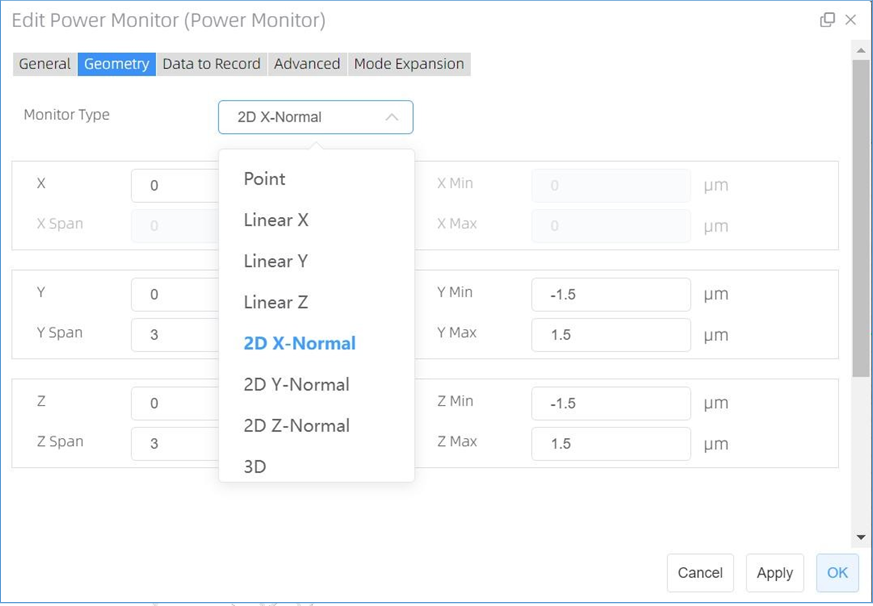

1 )	***Monitor Type:*** The monitor type and orientation, this option will control the available of spatial setting below, ***Point, Linear X/Y/Z, 2D X-Normal/2D Y-Normal/2D Z-Normal, 3D*** are included. ( Default: 2D X-normal)

2 )	***X/X Span; Y/Y Span; Z/Z Span:***
***X, Y, Z:*** The center position of the simulation region.

***X Min, X Max:*** X min, X max position.

***Y Min, Y Max:*** Y min, Y max position.

***Z Min, Z Max:*** Z min, Z max position.

***X SPAN, Y SPAN, Z SPAN:*** X, Y, Z span of the simulation region.

- **Data to Record tab:**

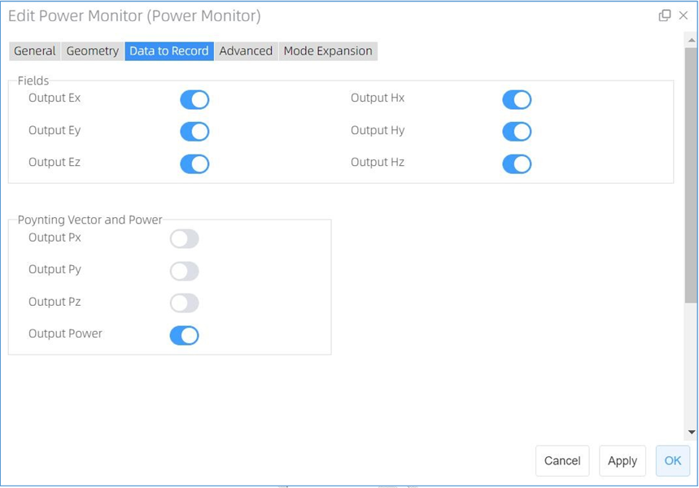

1 )	***Fields & Poynting vector and power:*** Output quantities EX, EY, EZ, HX, HY, HZ, PX, PY, PZ: The user can select from the field components (EX, EY, EZ, HX, HY, HZ) or the Poynting vector (PX, PY, PZ) those ones he/she wishes to measure. For 3D simulations, only part of the components are non-vanishing (i.e., for TE simulations only EX, EY, and HZ will make sense). However to facilitate fast switches between TE and TM simulations, all the field quantities will remain active.(2D simulation is inavailable at present).

2 )	***Output Power:*** The user can check this option to compute the power as an integral over the monitor surface, and it is for surface minitors (3D simultion) and line monitors (2D simulation) only. Once the simulation comes to end, this uses much less memory and is therefore rather appropriate for large parallel computations where only the integrated power over a surface is requested by the user. (2D FDTD is inavailable at present).

- **Advanced tab:**

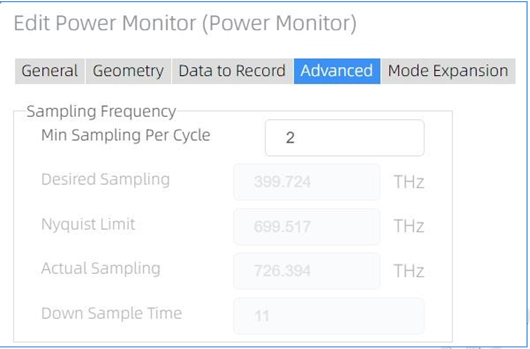

1 ) **Sampling Frequency**

->***Min Sampling Per Cycle:*** This parameter suggests the realistic minimum amount of samplings for each optical cycle. Default value is 2 (the Nyqusit limit) for sake of the optimum efficiency.

->***Desired Sampling:*** This converts the minimum sampling points in each optical cycle into an actual rate of sampling measured by Hz.

->***Nyquist Limit:*** The Nyquist limit of sampling is determined in accordance with the maximum frequencies that may arise in the simulation region.

->***Actual Sampling:*** The actual rate of sampling is identical to the rate that is actually employed for the discrete Fourier transform (DFT), by appropriately taking the desired sampling rate, the Nyquist limit, and the time step dt into account

->***Down Sample Time:*** This specifies the time for step down sampling.

- **Mode Expansion tab:**

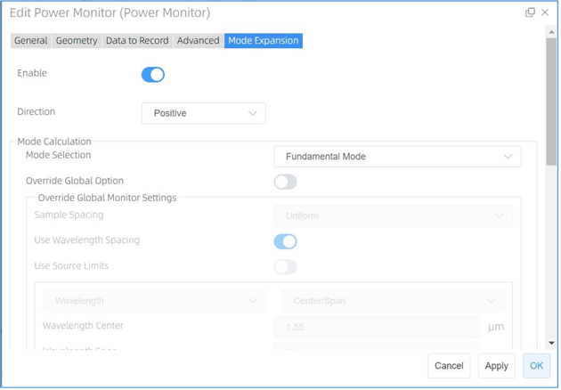

**Feature Description:** The user can use the Mode expansion monitor simulation objects to extract the fractional amount of power transmitted into any mode(s) of a non-absorbing waveguide or fiber. The Mode Expansion tab contains two main sections. The "Mode calculation" section allows you to select a mode (or a set of modes) to expand the input profile. The "Monitors for Expansion" section allows you to choose a field profile from an arbitrary monitor in the simulation to expand.

1 )	***Enable:*** If the status of the button is on, allows user to set the “Mode calculation” and “Monitors for Expansion”. (Default: off )

2 )	***Direction:*** Direction of the Mode expansion monitor. Two options Negative and Positive are available. (Default value: Positive)

3 )	***Mode Calculation:***

1.***Mode Selection:*** Allow you to select the modes for the mode expansion calculation, and user select, “Fundamental Mode”, “Fundamental TE Mode” and “Fundamental TM Mode” are included. (Default: User Select)

2.***Override Global Monitor Settings:***

->***Sample spacing:*** The sampling frequency or wavelength is determined somehow based on this combo-choice parameter.

->***Use wavelength spacing:*** As a default setting, data is recorded at certain spatially discretized points depending on the involved wavelengths

->***Use source limits:*** When checked, the source limits are used by the monitors. Otherwise one uses the pull down menus and their underlying boxes to specify the frequencies/wavelengths at which to collect data.

2.***Frequency Points:*** Sets to choose the number of frequency points at which to record data. (Default: 5)

1 ) ***Monitors for Expansion:*** After the modes have been selected, the next step is to choose the monitor with the input field profile. The "Add " and " Remove " buttons on the side can be used to add/remove monitors, and You can choose the desired monitor from the monitor drop down list.

4 )	***Bent Waveguide:*** Upon checking this option, the user can define a bent waveguide..

->Radius: Radius of the bent waveguide. (Default value: 1.000e+6 μm)

->Orientation: Orientation of the bent waveguide
	Location: Loaction of the bent waveguide. (at Simulation Center by default)
 
5 )	***Rotations:***
->***Theta:*** This refers to the angle of propagation measured by degrees, with respect to the incident axis of the source in a 3D simulation. In a 2D simulation, it is the angle of propagation measured by degrees revolved around the global Z-axis in compliance with the right-hand rule, that is, the angle of propagation in the XY plane.

->***Phi:*** This refers to the angle of propagation measured by degrees revolved around the incident axis of the source in compliance with the right-hand rule in a 3D simulation. In a 2D simulation, this value does not take effect.

->***Rotation Offset:*** A rotation offset can be endowed to the plane upon which the mode is computed. This guarantees that mode sources at an angle do not interfere with structures not belonging to the waveguide/fiber.

### FDTD Far Field

**Feature Description:** The FDTD far field function is used for calculating the EM fields in the far field region of the selected “Frequency-Domain Field and Power Monitor” through adopting a systematic near-to-far-field (NTFF) transformation without the necessity of extending the simulation region to the actual far field area. After a single FDTD simulation, the frequency-domain field data of the selected monitor can be accurately and efficiently projected to the far field region defined by a hemisphere with a radius of 1 meter which is positioned 1 meter away from the center of the monitor.

**Work flow: Result view-> Power monitor->Calculate-> Far Filed Settings-> OK**

- **Select Frequency**

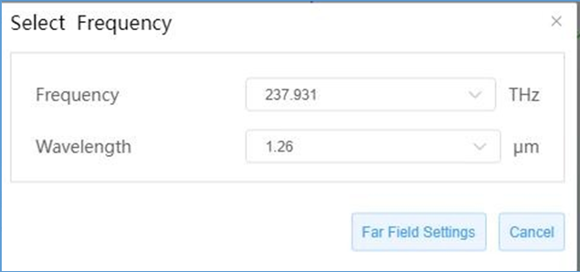

1 )	***Frequency:*** allows user to select the frequency based on the power monitor calculation results to project.

2 )	***Wavelength:*** allows user to select the wavelength based on the power monitor calculation results to project.

Click the “Far Failed Setting” button from the bottom left corner of the Select Frequency window an additional window will pop out.

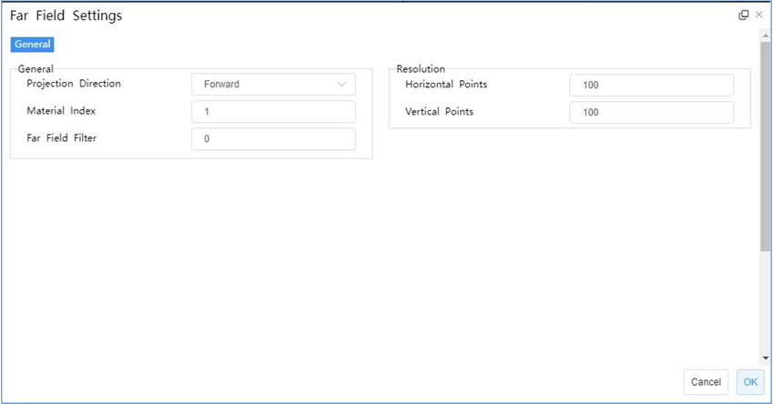

- **General Tab:**
 
1 )	***Projection Direction:*** Forward and backward projection direction can be set. Forward will project towards the positive axis direction and backward will project to negative axis direction.

2 )	***Material index:*** The refractive index of the medium to use for projection.

3 )	***Far Field Filter:*** Sets the far filter alpha parameter.

4 )	***Resolution:*** Sets the number of points in the far field to project to for 2D simulations.

After clicking the “OK ” button, the visualizer window will show up, user can check two types of far-field plot results via the “Draw” option box, one is a standard plot another is the polar plot.

- **Standard plot visualizer:**

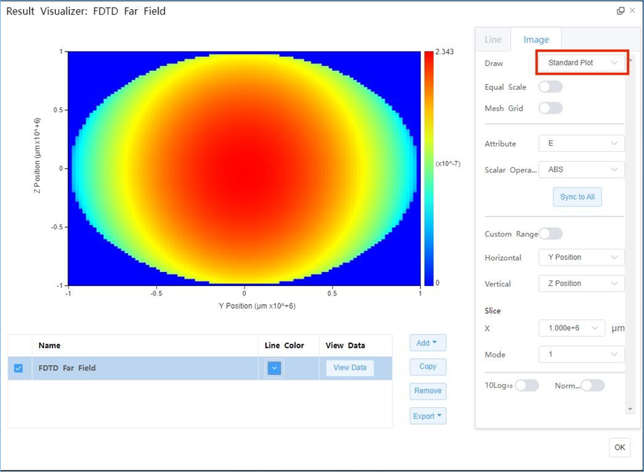

1. ***Drawing:*** Drawing the far fields (Default:Standard Plot)

2. ***Equal Scale:*** If checked, the result image will be shown in equal scale.

3. ***Mesh Grid:*** Mesh grid display settings

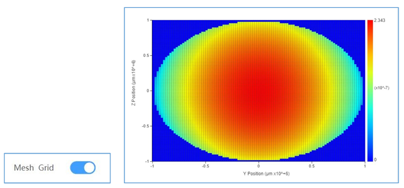

4. ***Attribute:*** Allow users to choose the attribute their interested in to plot, includes E, H, Energy density, Ex, Ey, Ez, Hx, and Hy. (Default: E)
 
5. ***Scalar Operation:*** A combo box allow user to choose the operation their interested in to plot, includes amplitude, phase, real, and imaginary. (Default: Amplitude)

6. ***Custom Range:*** If checked, allow user to custom range to plot via the following options settings, includes horizontal (min/max), vertical (min/max), slice (x), mode (default: 1), color bar (min/max) and scale (Linear/ log).

7. ***Data List:*** The result data of far field projection will be loaded here after running the far field projection.

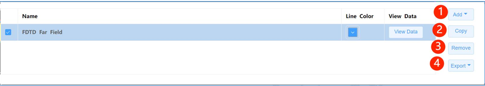

->***Name:*** The FDTD far field name.

->***Line Color:*** User can customize the line’s color interested in.

->***View Data:*** Allows user to view the data of far field , after pressing the button a FDTD Far Field data table will pop out.

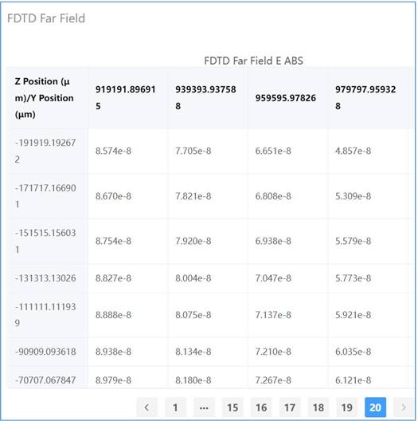

1. ***Add:*** Add the far field result to plot.

2. ***Copy:*** Copy a far field result data in the list to plot.

3. ***Remove:*** Remove the selected result data.

4. ***Export:*** Export the selected far field result data. The export button supports users exporting the data file they are interested in. Two types of files with two formats can be exported, one is the “export graph data” (.csv/.mat), and another is “export monitor data (CSV/mat/zbf).

- **Polar Plot Visualizer**

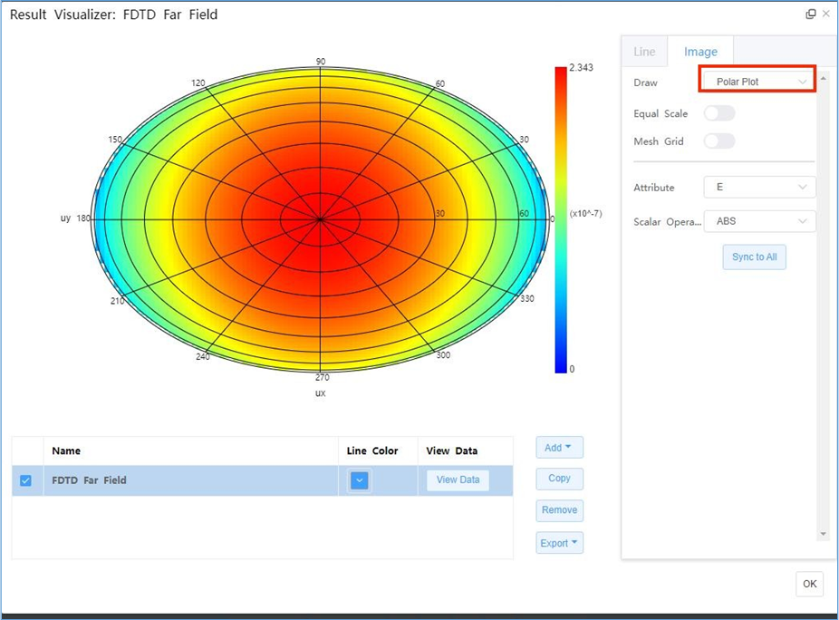

### Field time monitor

- ***Feature Description:** These monitors collect time-domain data for field components over the entire simulation course. Point, line or area monitors can be set and used for collecting such information over various spatial scales inside the simulation regions.

- **General Tab:**

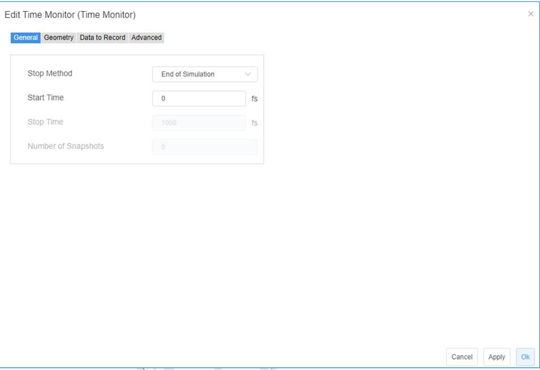

The general tab for the time domain monitor includes options to edit the amount of data, and time period over which data is collected.

1 )	***Stop Method: “End of Simulation”, “Choose Stop Time” and “Choose Number of Snapshots”***.

2)	***Start Time:*** The time to switch on recording.

3)	***Stop Time:*** The time to end recording.

4)	***Number of Snapshots:*** The number of time steps to be recorded..

- **Geometry tab:**

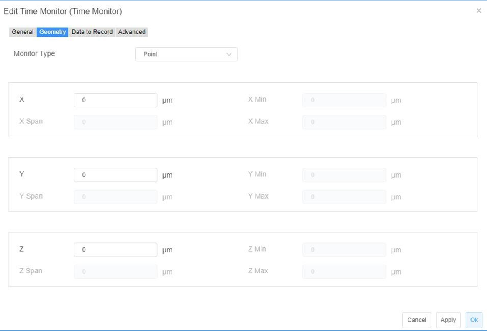

1 )	***Monitor Type:*** The monitor type and orientation, this option will control the available of spatial setting below , “Point”, “Linear X”, “Linear Y”, “Linear Z”, “2D X-Normal”, “2D Y-Normal”, “2D Z-Normal”,3D are included. (Default: Point)

2 )	***X,Y,Z:*** The center position of the simulation region.

3 )	***X Min/X Max:*** X min, X max position.

4 )	***Y Min/ Y Max:*** Y min, Y max position.

5 )	***Z Min/ Z Max:*** Z min, Z max position.

6 )	***X Span/ Y Span / Z Span:*** X, Y, Z span of the simulation region.

- **Data to Record tab:**

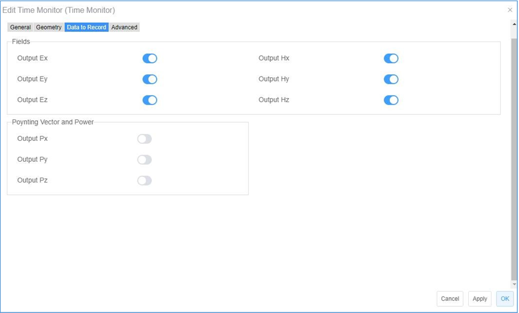

1 )	***Fields & Poynting vector and power:*** Output quantities EX, EY, EZ, HX, HY, HZ, PX, PY, PZ: The user can select from the field components (EX, EY, EZ, HX, HY, HZ) or the Poynting vector (PX, PY, PZ) those ones he/she wishes to measure. For 3D simulations, only part of the components are non-vanishing (i.e., for TE simulations only EX, EY, and HZ will make sense). However to facilitate fast switches between TE and TM simulations, all the field quantities will remain active.(2D simulation is not available)

- **Advanced tab:**

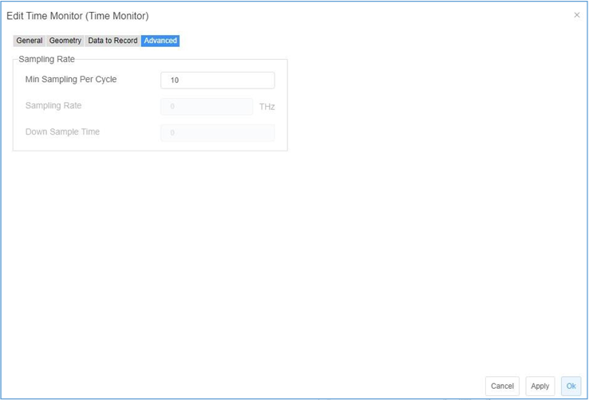

Sampling rate:
1 )	***Min Sampling Per Cycle:*** This parameter indicates the realistic minimum amount of samplings in each optical cycle. Default value is 10.

2 )	***Sampling Rate:*** The actual rate of sampling measured by THz.

3 )	***Down Sample Time:*** This specifies the time for step down sampling.

### EME Profile Monitor

- **Feature description:** EME profile monitors work in the frequency domain to extract field profiles from the simulation results produced by an EME solver over some spatial regions.

- **Geometry tab:**

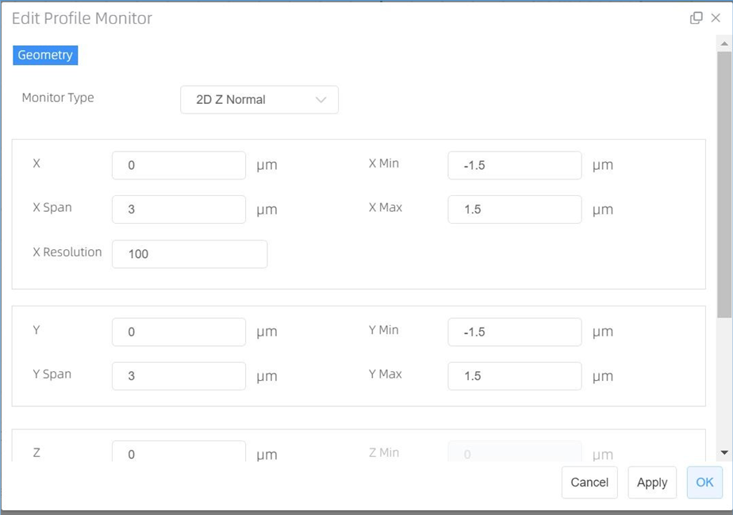

1 )	***Monitor Type:*** This option specifies the monitor type and orientation, and will affect the availability of the spatial settings below.

2 )	***X, Y, Z:*** The center position of the simulation region.

3 )	***X Min, X Max:*** X min, X max position.

4 )	***Y Min, Y Max:*** Y min, Y max position.

5 )	***Z Min, Z Max:*** Z min, Z max position.

6 )	***X Span, Y Span, Z Span:*** X, Y, Z span of the simulation region.

7 )	***X Resolution:*** The number of mesh steps along propagation direction.

### Global Option (FDTD)
- **Feature description:** The global monitor settings, the parameter in this window will be adopted in other monitors if your override global options is unchecked.

- **Notes:** Monitors with override global option tab include profile and power monitor, reflective monitor and mode expansion.

- **Frequency power tab:**

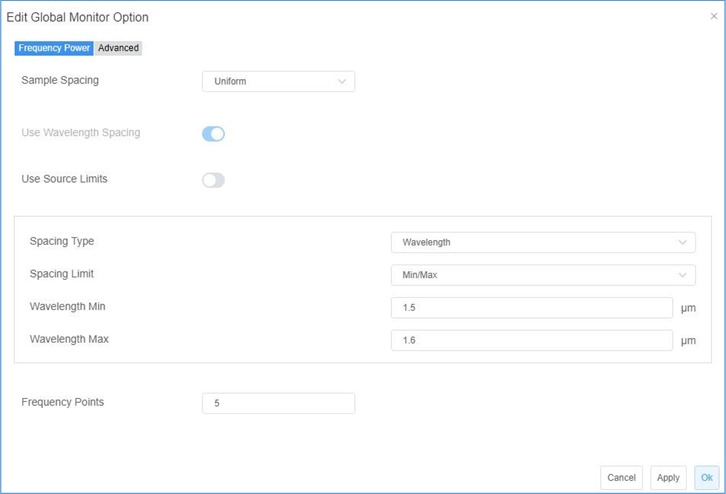

1 )	***Sample Spacing:*** The parameter determines how the sample frequency/wavelength will be selected, currently the option is “uniform”.

2 )	***Use Wavelength Spacing:*** Data is recorded at certain spaced points with respect to frequency. Selecting this option spaces data at certain spaced points with respect to wavelength.

3 )	***Use Source Limits:*** When checked these monitors use the source limits. When unchecked, the frequencies/wavelengths at which to record data can be set using the pull down menus and boxes below them.

4 )	***Spacing Type:*** Set spacing type, the options are wavelength and frequency.

5 )	***Spacing Limit:*** Set spacing limits, you can set min/max of wavelength and center/span of wavelength. When the use source limits option is checked, this option will be disabled.

6 )	***Frequency Points:*** Set to choose the number of frequency points at which to record data (Default 5).

- **Advanced tab:**

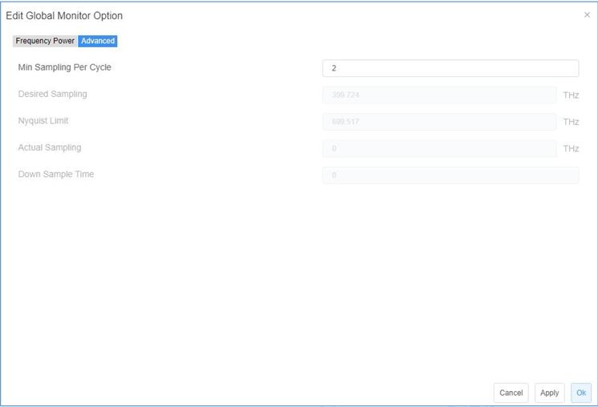

1 )	***Min Sampling Per Cycle:*** This parameter suggests the realistic minimum amount of samplings for each optical cycle. Default value is 2 (the Nyqusit limit) for sake of the optimum efficiency.

2 )	***Desired Sampling:*** This converts the minimum sampling points in each optical cycle into an actual rate of sampling measured by Hz.

3 )	***Nyquist Limit:*** The Nyquist limit of sampling is determined in accordance with the maximum frequencies that may arise in the simulation region.

4 )	***Actual Sampling:*** The actual rate of sampling is identical to the rate that is actually employed for the discrete Fourier transform (DFT), by appropriately taking the desired sampling rate, the Nyquist limit, and the time step dt into account.

5 )	***Down Sample Time:*** This specifies the time for step down sampling.
