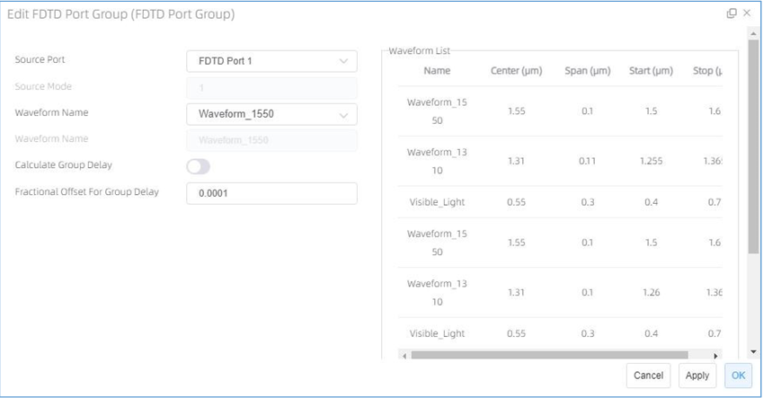
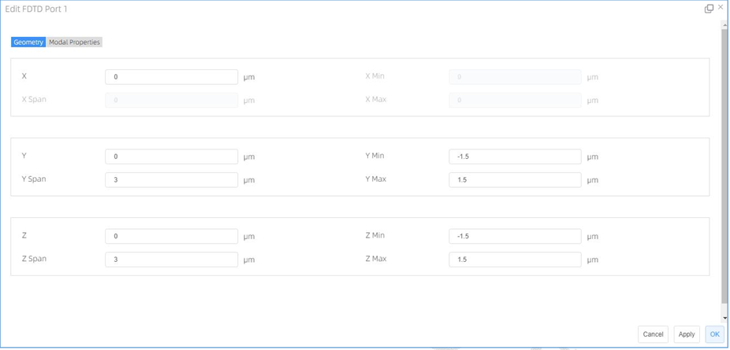
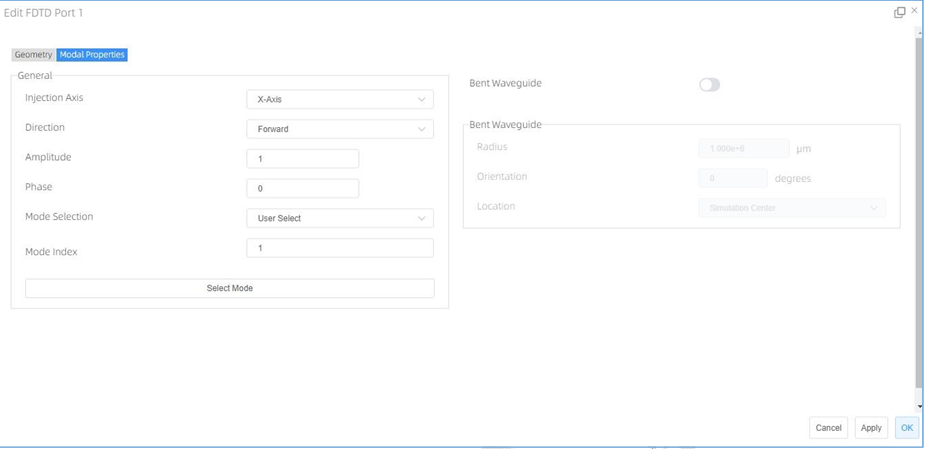
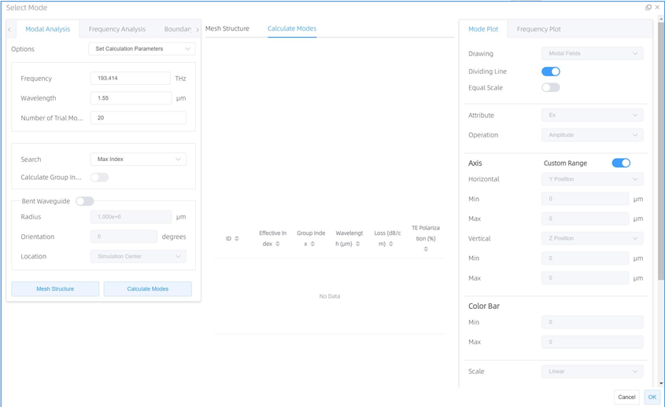
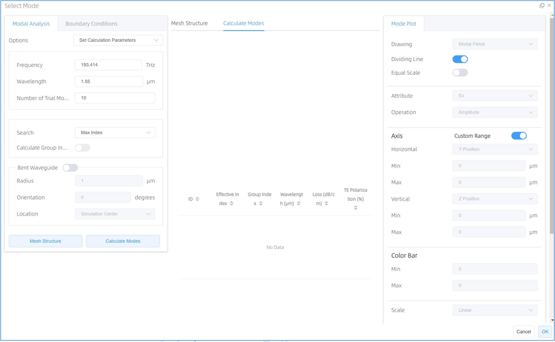
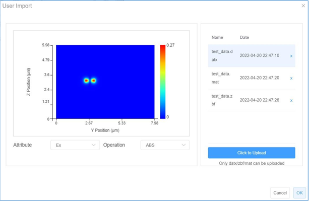

# Port
---
sidebar_position: 1
---
## FDTD Port:
- **Feature description:**
Ports are usually viewed as a combination of mode source, field monitor and mode expansion monitor. Ports can be used either separately or together with the S-parameter sweep tool to compute the S-parameters for a device by means of the mode expansion method.

- ***Notes:***
Press the "Port" button in the menu bar, and select "FDTD Port" from the drop-down menu to add a port. Note that the prerequisite is that an FDTD simulation region must be already there. Upon adding a port, a port group named “Ports” is automatically generated as the child of the “Object Tree” , and all port objects are enclosed in this group. In particular, the port hierarchy is arranged in such a manner that ports cannot be moved outside the “Ports group”, and other objects are not allowed to be moved into the group.
- **FDTD Port Group tab:**

1) **Source Port:**
This option enables you to choose one from a list of the existing ports as the source port.

2) **Source Mode:**
The mode of each port can be selected through “Mode Selection” in its “Modal Properties” tab, after which the mode number is recorded in “Source Mode” automatically

3) **Waveform Name:**
Waveform name is identified by **“Waveform ID”**.

- **The Geometry tab of FDTD Port:**

1) **X,Y,Z:**
The center position of the simulation region.

2) **X Min, X Max:**
X min, X max position.

3) **Y Min, Y Max:**
Y min, Y max position.

4) **Z Min, Z Max:**
Z min, Z max position.

5)**X Span, Y SP, Z Span:**
X, Y, Z span of the simulation region.

- **The Modal properties tab of FDTD port tab:**

1)**Injection Axis:**
This indicates the axis of propagation. The geometry parameters that will work under the "Geometry" tab may depend on this setting (For instance, if the incident wave is along the x-axis, the port object possesses accordingly a 2D x-normal geometry).

2)**Direction:**
This field indicates the direction of source propagation. Forward means the propagation is along a positive direction, while Backward means the propagation is along a negative direction.

3)**Amplitude:**
 "Amplitude" specifies the peak magnitude of electric field measured by V/m in the beam sources. (Default :1)

4)**Phase:**
This refers to the phase of the source measured by degrees.

5)**Mode Selection:**
This enables the user to select the modes used in the mode expansion computations. The eigenmode solver, with which the user may compute and visualize the supported modes (See “Mode Analysis”), is launched by checking the "User Select" option---this option can also be used to select the desired mode among multiple ones. Besides, the eigenmode solver offers a toolkit of frequency analysis. (See "Frequency Analysis")

6)**Bent Waveguide:**
Selecting this option enables the bent waveguide solver to work with the following settings:.

->**Bend Radius**:This specifies the bend radius in units of um counted from the center of the port region. (Default value: 1.000e+6 um)

->**Bend Orientation**: This specifies the orientation of the cylindrical coordinates employed for the computation of modes.Orientation of the cylindrical coordinate system used for calculating modes.

->**Bend Location**: This option specifies the location of bend. (Note that only the simulation center is supported at present)

**Mode Analysis window**

**Frequency Analysis window**

1)**Offset:** An offset can be endowed to the plane upon which the modes are computed. This guarantees that monitors placed at an angle do not interfere with unexpected structures.

2)**Number of Trial Modes:** This specifies the number of modes to search for finding a fundamental mode. The modes eventually found by the solver may depend on that. If one uses a too small number, the expected modes could be missing. Usually, setting this number to 100 suffices to guarantee no physical modes would have been missed. However, users who are interested in higher order modes should set a even larger value, since in such cases more than 100 modes may be present. (Default value: 20)

3)**Mode Selection:**

1.Allow you to select the modes to use for the mode expansion calculation. The "user select" option launches the eigenmode solver where the user can calculate and visualize the supported modes; use this option to select multiple modes. The "Mode calculation" section Allow you to select a mode they are interested in. The user S-matrix result returns the S-matrix for these selected modes. A selected mode can also be used as an input source in the EME propagation stage of the analysis, Fundamental Mode, Fundamental TE Mode, Fundamental TM Mode, Fundamental TE and TM Mode, Use Select and User Import are included. (Default: fundamental mode)

2.Checking the "user select" option enables you to specify mode parameters in the ``Select Mode'' window. The number of trial modes will be displayed in the mode list after they are solved by computation. The plot options of the user's interest can be specified in the mode plot options section.

- **Select Mode tab:**

3.***User import:*** Import arbitrary source fields into EME ports. It is possible to use a custom field profile from a .mat file, .datx file or .zbf file as the source in an EME simulation. The field profile data can be from another simulation. To set this as a port mode, open the Edit EME port tab, select “User import” under mode selection and click on “Import Field”.

Click the “Click to upload” button, select a generated custom field profile, if you has imported several profiles in the right section, you can specify one of them from right section, then the custom field profile has been imported successfully. Finally, click the “OK” button to save the custom profile.

