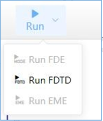

# Run

- **Feature description:**
Run simulation

- ***Notes:***

1. Please save all the settings, before running simulation.

2. If user chooses FDE simulation, the work flow is Run->Run FDE -> FDE Analysis -> Calculate modes.

3. If user chooses EME simulation, the work flow is Run->Run EME -> EME Analysis->EME propagation / EME sweep / Wavelength sweep.

4. If user chooses FDTD simulation, the work flow is Run->Run FDTD.

5. Supports simulation memory requirements check.

