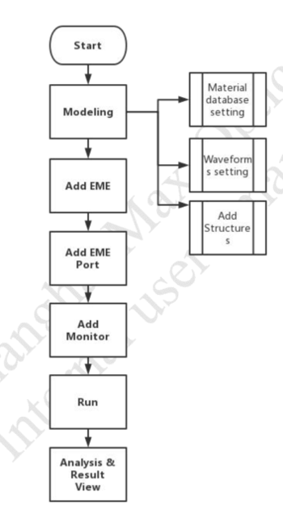
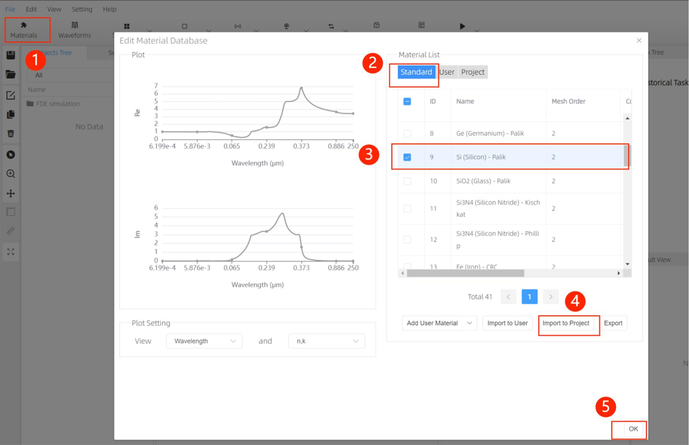
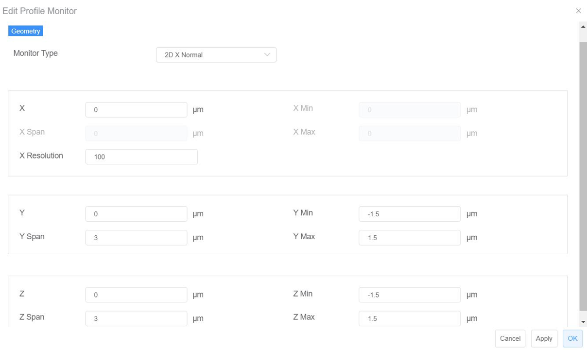
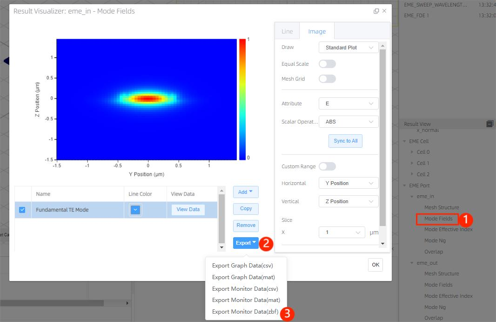

# EME

## definition

The bidirectional eigenmode expansion (EME) solver is ideal for simulating light propagation over long distances. The computational cost of the method scales exceptionally well with the device length, making it much more efficient for the design and optimization of long tapers and periodic devices compared to FDTD-based methods.

# How to use Max-Optics V2.3.0.0 Local Passive to run EME and view the simulation result

## **Objectives:**

In this example, we show how to use Max-Optics to run EME and view the simulation result.

## Works Flow:

**1) Modeling:**
- **Material database settings:**
Press on “Material “ button, the material database window will bring out, and import new materials from standard material database or user material database into project material database according to user needs.( when import success a prompt information will pop out informs that “Import Success. Success: 1/1, Fail: 0/1 (duplicated)”.

**Material work flows:**

- **Add a rectangle :**
Press arrow on the ***“Structures”*** button, and select a Rectangle from the drop-down menu. Set the
properties of the substrate rectangle according to the following table.

Menu bar->Structures->Rectangle->Geometry->Material

| Tab      | Property               | Value| 
| -- | -------------------------------- | --------------- | 
| Geometry | X(um)                        | 0             | 
| Geometry | X Span(um)                   | 10            | 
| Geometry | Y(um)                        | 0             | 
| Geometry | Y Span(um)                   | 0.5           | 
| Geometry | Z(um)                        | 0             | 
| Geometry | Z Span (um)                  | 0.2           | 
| Material | Material                     | Si            | 
| Material | Mesh Order                   | 2             | 

**2) Add EME:**
Press arrow on the ***“Simulation”*** button, and select the ***“EME”*** from the drop-down menu, and set
the properties according to the following table.

| Tab         | Property                | Value                  |
|-------------|-------------------------|------------------------|
| General     | Background Material     | Object Defined Dielectric |
|             | Wavelength (um)         | 1.55                   |
|             | Frequency               | Default value          |
|             | Use Wavelength Sweep    | On                     |
| EME Setup   | X min (um)              | -5                     |
|             | Energy Conservation     | Make passive           |
|             | Cell group definition   | Default                |
|             | Y (um)                  | 0                      |
|             | Y Span (um)             | 3                      |
|             | Y min (um)              | -1.5                   |
|             | Y max (um)              | 1.5                    |
|             | Z (um)                  | 0                      |
|             | Z Span (um)             | 3                      |
|             | Z min (um)              | -1.5                   |
|             | Z max (um)              | 1.5                    |
| Transverse  mesh settings | Define Y mesh            | Maximum mesh step      |
|             | Define Z mesh            | Maximum mesh step      |
|             | Min Mesh step (um)      | 0.0001                 |
|             | Grading Factor          | 1.2                    |
|             | dy                      | 0.02                   |
|             | dz                      | 0.02                   |
|              Boundary conditions    |  | Default                |
|              Material type        |   | Default                |
|              Advanced options       | | Default                |
|              Tread setting          | | Default                |

- **General Tab**

- **EME Setup Tab**

- **Transverse Mesh Setting Tab**

**3) Add EME Port:**

| Tab           | Property          | Value                    |
|---------------|-------------------|--------------------|
| EME Port(left)      |
| Port location  |   | Left                     |
| Geometry      | Y (um)            | 0                        |
|               | Y Span (um)       | 3                        |
|               | Y min (um)        | -1.5                     |
|               | Y max (um)        | 1.5                      |
|               | Z (um)            | 0                        |
|               | Z Span (um)       | 3                        |
|               | Z min (um)        | -1.5                     |
|               | Z max (um)        | 1.5                      |
| EME port       |    | Default                  |
| EME Port(right)      |
| Port location    | | Right                    |
| Geometry      | Y (um)            | 0                        |
|               | Y Span (um)       | 3                        |
|               | Y min (um)        | -1.5                     |
|               | Y max (um)        | 1.5                      |
|               | Z (um)            | 0                        |
|               | Z Span (um)       | 3                        |
|               | Z min (um)        | -1.5                     |
|               | Z max (um)        | 1.5                      |
|                EME port          || default                  |

- **Geometry Tab of EME Port 1(Left)**

- **Geometry Tab of EME Port 2(Right)**

**4) Add Monitor (EME Profile monitor):**

Press arrow on the ***“Monitor”*** button and select ***“EME Profile Monitor”*** from drop-down manual.
And set the properties according to the following table

 
| Tab       | Property         | Value          |
|-----------|------------------|----------------|
| Geometry  | Monitor type     | 2D X-normal    |
|           | X (um)           | 0              |
|           | X Span (um)      | 0              |
|           | X resolute       | 100            |
|           | Y (um)           | 0              |
|           | Y Span (um)      | 3              |
|           | Z (um)           | 0              |
|           | Z Span (um)      | 3              |

- **Geometry Tab of Profile Monitor**

**Notes:** Before simulation, please press ***“File”*** button, and select ***“Save”*** from drop-down manual,
manually. (File -> Save)

**5) Run & Result View**

Press arrow on the “Run” button and select “Run EME” from drop-down menu.

After running, the ***“EME Analysis”*** window will pop out, in this window, you can run ***“EME Propagate”***, ***“Propagation Sweep”*** and ***“Wavelength Sweep”*** via press buttons respectively.

① **EME propagate**

Press arrow on the ***“EME propagate”*** button, and you can view the EME propagate result via clicking EME result in Result View.

You can view different plot types via ***“Scalar Operation”*** options, and in attributes list, you can
choose parameter which is interested in to view

  

② **Run Propagation sweep**

Press arrow on the ***“Propagation Sweep”*** button, and after running, ***“EME Propagation Sweep”*** window will pop out, you can view the result about Propagation Sweep. User can view different view via clicking options in S11, S12, S21 or S22 port box.

 

③ **Run Wavelength Sweep**

Press arrow on the ***“Wavelength Sweep”*** button, and after running, ***“EME Wavelength Sweep”*** window will pop out, you can view the result about Wavelength Sweep.

You can view different results via the options in S11/S12/S21/S22 Port box.

④ **Matrix Index Mapping**

Show the information about the mode corresponding to the port.

⑤ **zbf Export**

The EME port and EME cell results support exporting mode information in a zbf format file.

- **Works flows: Result View->EME port/EME Cell->Mode Fields->Export ->OK**

**Notes:**
1. The simulation cases involved in the manual are only limited to guiding user how to use Max-Optics Studio silicon-based passive product running simulation, not for other purposes;
2. The screenshot pictures are gained, under Hardware environment: Name: LAPTOP-MHBJS336 (MateB ook 14), Windows11, and software environment: Google browser, version:108.0.5359.125.

