# FDE

## 

The Finite-Difference Eigenmode (FDE) solver calculates the spatial profile and frequency dependence of modes by solving Maxwell's equations on a cross-sectional mesh of the waveguide.  The solver calculates the mode field profiles, effective index, and loss.  Integrated frequency sweep makes it easy to calculate group delay, dispersion, etc.  The solver can also treat bent waveguides.

# How to use Max-Optics V2.3.0.0 Local Passive to run FDE and view the simulation result

## Objectives:
In this example, we show how to use Max-Optics local passive to run FDE and view the simulation result.

## Works Flow:
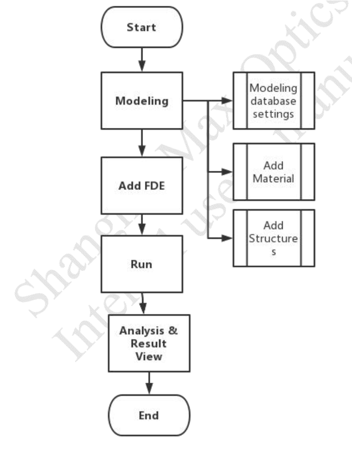

**1) Modeling:**
- **Material database settings:**
 
Press on “Material “ button, the material database window will bring out, and import new materials from standard material database or user material database into project material database according to user needs.( when import success a prompt information will pop out informs that “Import Success. Success: 1/1, Fail: 0/1 (duplicated).”)

Material work flows:

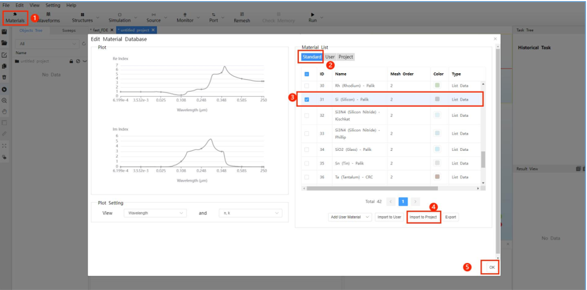

- **Add a rectangle:**
- 
Press arrow on the ***“Structures”**** button, and select a Rectangle from the drop-down menu. Set the properties of the rectangle according to the following table.

  Menu bar->Structures->Rectangle->Geometry->Material

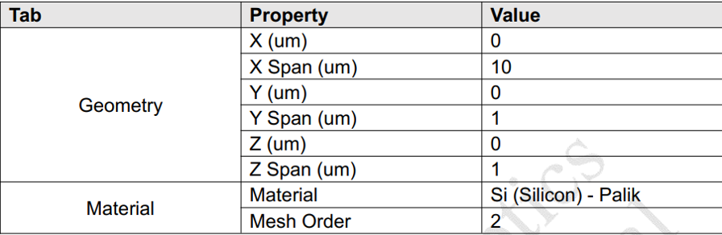

**2) Add FDE:**

Press arrow on the ***“Simulation”*** button, and select the FDE from the drop-down menu, and set the properties according to the following table.

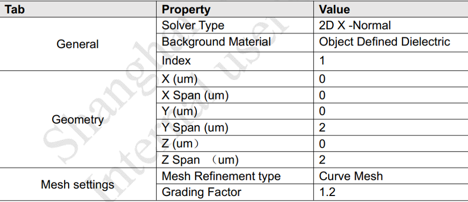

**Notes:** For other settings like “boundary conditions”, “advanced” and “thread setting “are adopted by default, additionally, before simulation, please press ***“File”*** button, and select ***“Save”*** from drop-down menu, manually. (File -> Save)

**3) Run:**

Press arrow on the ***“Run”*** button in the menu bar and select ***“Run FDE”*** from drop-down menu.After pressing ***“Run FDE”*** button, a FDE Analysis window will pop out, and You can choose modal analysis or frequency analysis to calculate.

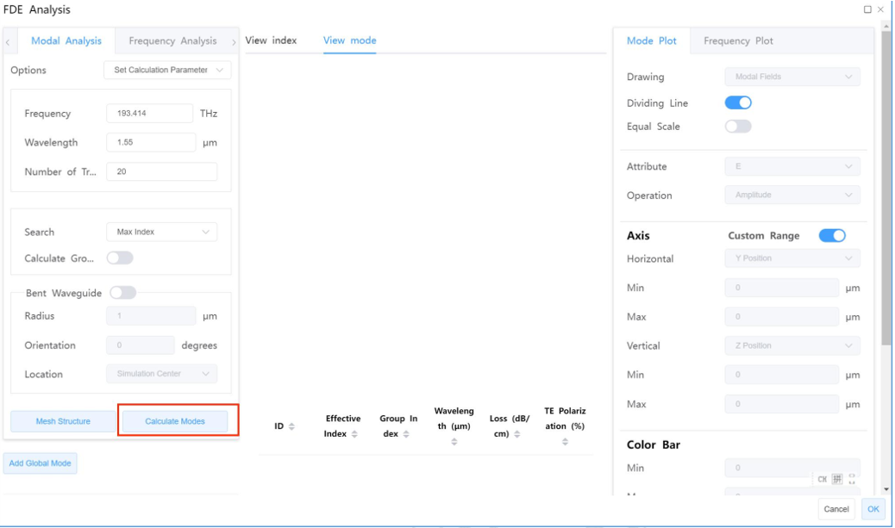

After pressing the “Calculate Modes” button, the simulation process will display on the right side Task Tree bar.

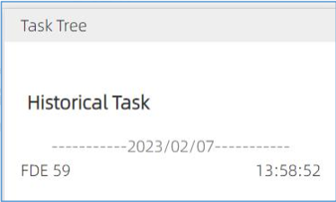

**4) Result view**

Press “OK” button after simulation finishing, and view the result in the Result View.

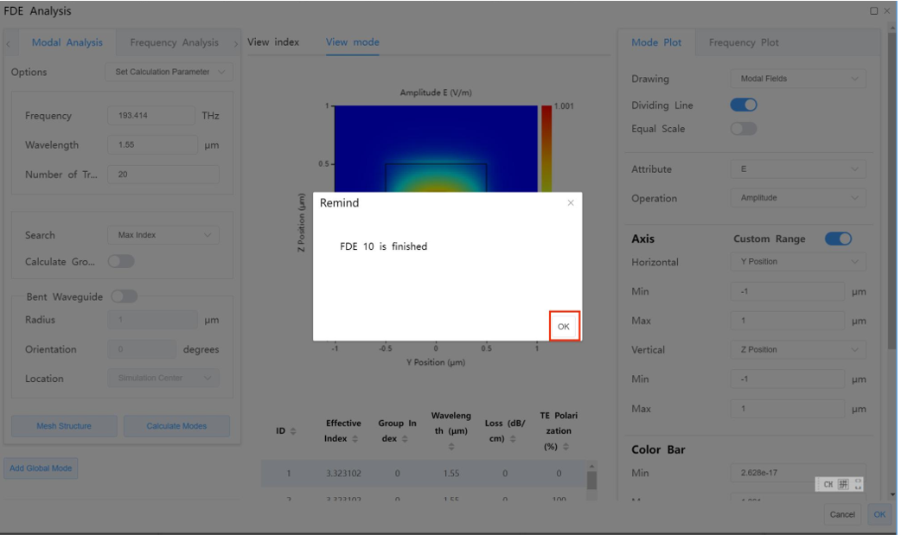

**Notes:**

If you want to change a certain parameter (e.g., the wavelength value) and simulation again you can change wavelength value in the modal analysis window and press “Calculate modes” directly without modeling again

After setting the wavelength value to 1.56um, press the “Calculate Modes” button.

You can view the simulation result in the Result View, when wavelength value equals to 1.56um.

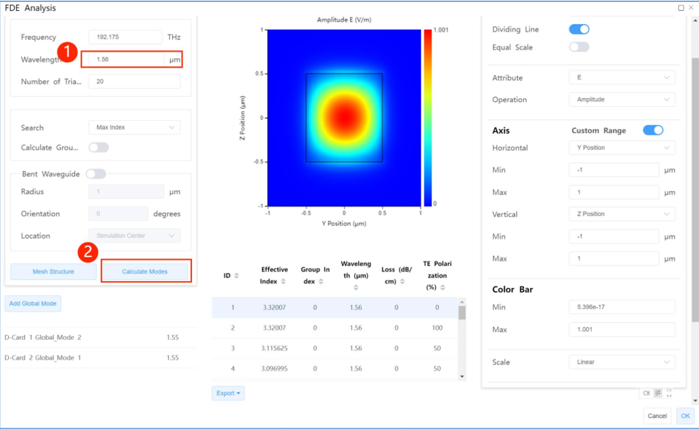

You also can view other plot image via ***Mode plot*** options. If You want to get frequency analysis
result, you can switch to ***“Frequency Analysis”*** tab, and set the relative parameters in the
***“Frequency Analysis”*** window. Then press the ***“Frequency Analysis”*** button.

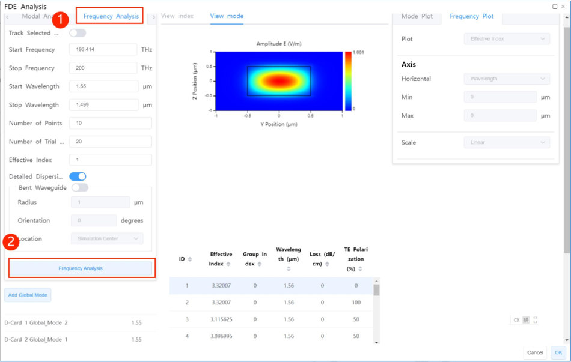

Press “OK” button after simulation finishing, and view the result in the Result View.

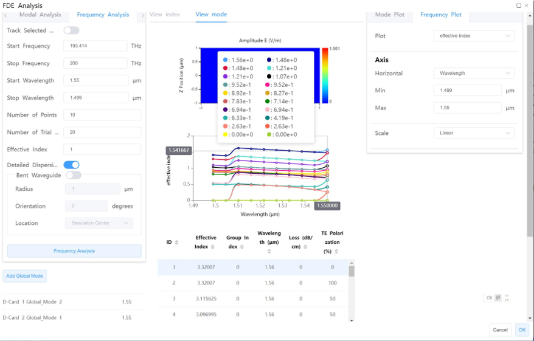

After running, the result will be saved in Task Tree automatically

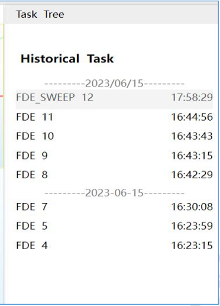

You also can view the result in Result View via clicking the FDE result item.

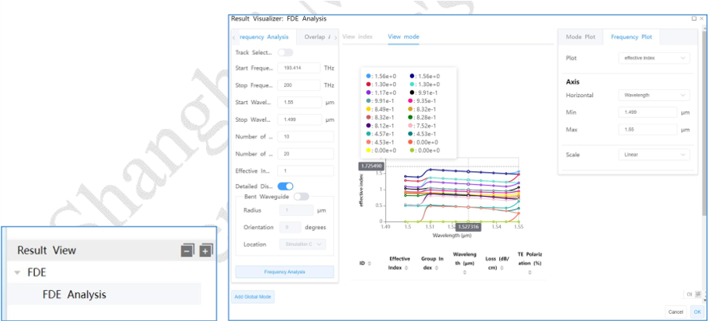