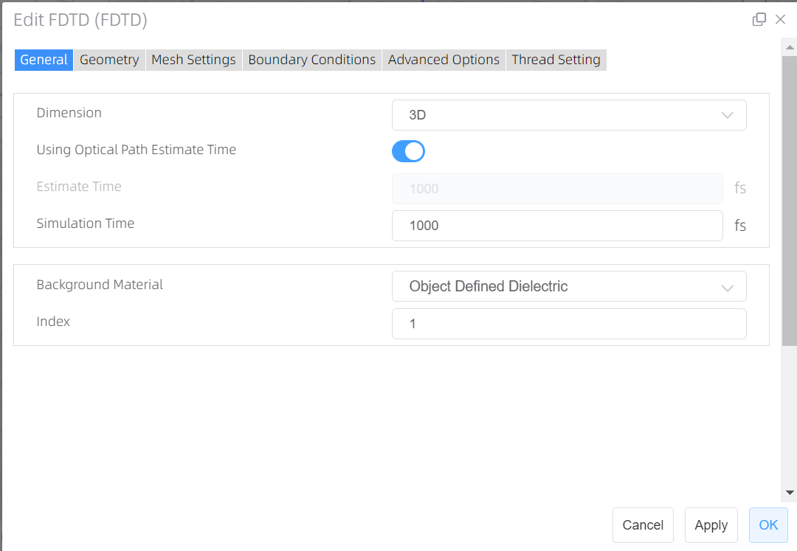
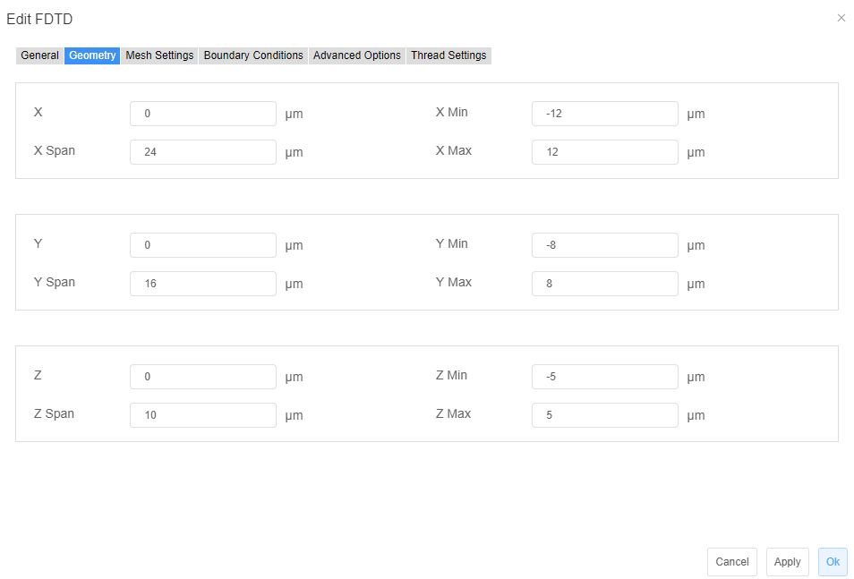
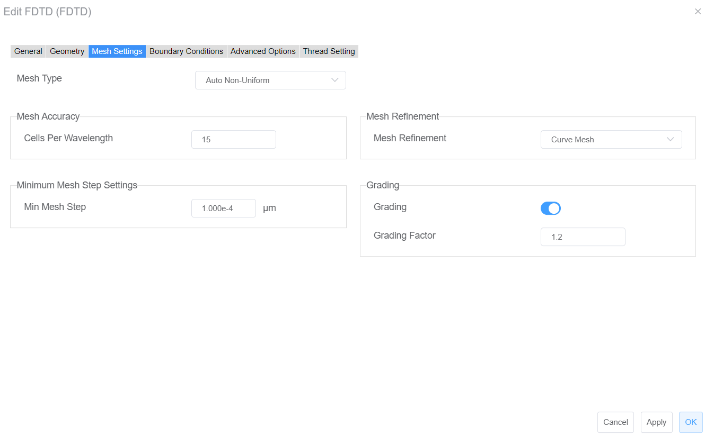
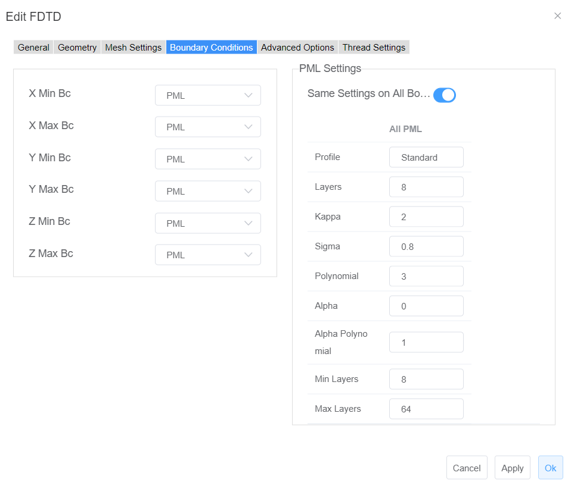
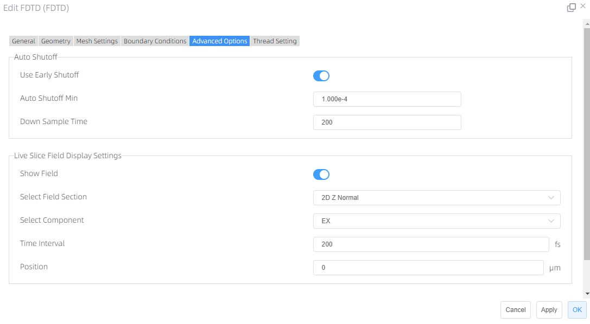
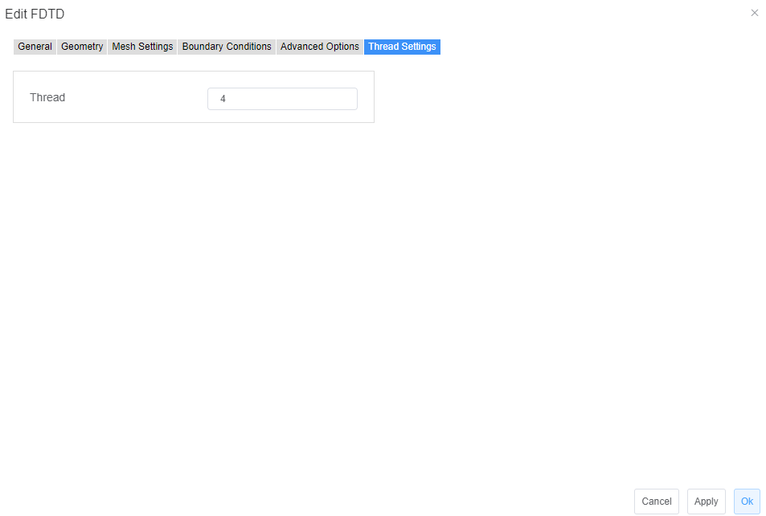

# FDTD Solver

## Solver Physics: 
+ __Finite-difference time-domain (FDTD) or Yee's method__ (named after the Chinese American applied mathematician Kane S. Yee, born in1934) is a numerical analysis technique used for modeling computational electrodynamics (finding approximate solutions to the associated system of differential equations). Since it is a time-domain method, FDTD solutions can cover a wide frequency range with a single simulation run, and treat nonlinear material properties in a natural way.
For more details about FDTD can search on Wikipedia.

+ __Features Description:__ Adds or sets FDTD simulation region and boundary conditions.

__Notes :__ When FDTD solver is selected, user cannot add FDE solver and EME solver at the same time. 

###  __General tab:__

1.	__Dimension:__ The dimension of the simulation region, the default set is 3D.
2.	__Using Optical Path Estimate Time:__ It is the switch button that the estimation of simulation time based on optical path.
3.	__Estimate Time:__ Estimated simulation time. (when “Using Optical Path Estimate Time” is enabled, it is displayed and non-editable.
4.	__Simulation Time:__ The maximum duration of the simulation to be performed. The actual simulation may be shorter if the auto-shutoff criteria are satisfied before this maximum simulation time is exceeded. The default set is 1000 fs.
5.	__Background Material:__ The combo box allows user to set the background material from drop down menu. “Project”, “Object Defined Dielectric”, and “Go to Material Library” can be operated.
6.	__Project:__ The “Background Material” can be selected from the “Project” sublist in the “Material Database” based upon the needs.
7.	__Object Defined Dielectric:__ The object-defined dielectric material, a default setting if user forgets to set background material, is defined for the current object background material setting, and once the user chooses this option, he does not need to set any material from the standard, user, or project material database. And the object-defined dielectric will not be loaded into any material database.
    __Go to Material Library:__ If selected, user can go to standard material database to set background material according to needs. And the selected material relative property from standard material database will be displayed in the material data list.
8.	__Index:__ The refractive index of the surrounding, background medium in the simulation region.（Default: 1)

### Geometry tab:

1. __X, Y, Z:__ The center position of the simulation region.
2.	__X Min, X Max:__ X min, X max position.
3.	__Y Min, Y Max:__ Y min, Y max position.
4.	__Z Min, Z Max:__ Z min, Z max position.
5.	__X Span, Y Span, Z Span:__ X, Y, Z span of the simulation region.

###  Mesh Settings tab:

1.	__Mesh Type:__
Two types of mesh generation algorithms are available, as described below;
__1. Auto non-uniform (Default)__
        A non-uniform mesh is automatically generated based on the mesh accuracy slider bar.
__Uniform__
    A uniform mesh is applied to the entire simulation volume, regardless of any material properties. If a mesh override region is used in conjunction with this option, the override region will force the mesh size everywhere, not just within the override region (the mesh is uniform).
2.	__Mesh Accuracy:__ Sets cells per wavelength. The default set is 15.
3.	__Minimum Mesh Step Settings:__ Set the absolute minimum mesh size for the entire solver region. 
4. __Mesh Refinement:__ Mesh refinement can give sub-cell accuracy for a simulation.
__1.Staircase:__ The material at each position of the Yee cell is evaluated to determine which material it is in, and the E field at that location uses only that single material property. The resulting discretized structure is unable to account for structure variations that occur within any single Yee cell, resulting in a "staircase" permittivity mesh that coincides with the Cartesian mesh furthermore, any layers are effectively moved to the nearest E field position on the Yee cell, meaning that layer thickness cannot be resolved to better than dx.
__2. Curve Mesh:__ Effective permittivities are derived using a contour path approach that accounts for the boundary conditions of the electromagnetic field at dielectric interfaces.
5.	__Grading:__ Grading factor, determines the maximum ratio of the neighboring spatial steps.

### Boundary Conditions tab: 
  

1.	__PML:__ Perfectly matched layer (PML) boundaries absorb electromagnetic waves incident upon them. They essentially model open (or reflectionless) boundaries.
2.	__PEC:__ PEC boundary conditions are used to specify boundaries that behave as a Perfect Electric Conductor (PEC). Metal boundaries are perfectly reflecting, allowing no energy to escape the simulation volume along that boundary.
3.	__PML settings:__ When the state of the Same Settings on All Boundary Conditions is on, all PML boundaries share the same profile based on the properties listed in the table, including “Layers”, “Kappa”, “Sigma”, “Polynomial”, “Alpha”, “Alpha Polynomial”, “Min Layers”, and “Max Layers”; otherwise, each PML boundary can be set individually.
4.	__X/Y/Z min/ max PML:__ These fields describe the boundary conditions to be applied along the perimeter of the simulation region.

### Advanced Options tab: 
  

1.	__Auto Shutoff :__ Stops the simulation when the energy in the simulation goes below the “Auto Shutoff Min” when the “Use Early Shutoff ” state is on , you can set min auto shutoff (Default: 1e-4) and down sample time (Default: 200)
2.	__Down sample time:__ The time step down sampling. (It is default: 200, and 10 <= it <= 1000)
3.	__Live Slice Field Display Settings__
__Show Field:__ Real-time filed slice display switch. (Default: on)
Select Field Section: Combo box allows you to choose from a list of 2D planes normal to the axes for field display. ( 2D Z Normal by default）
　__Select Component__：Combo box allows you to choose from a list of the existing field components ( Ex by default)
　__Time Interval:__ The time step down sampling (200 fs by default)
　__Position:__ The position of slice (0 μm by default)

###  Thread Settings tab:

1. Thread：Through thread setting can improve running effects, which makes simulation significantly faster than prior. (Default: 4)