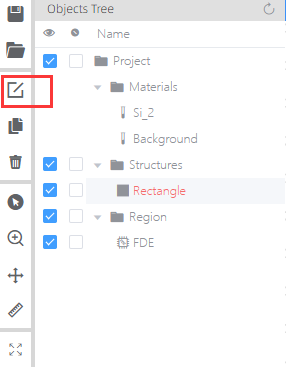

# Structure

__Features Description: Add or Edit Structures.__

1. Structures 

There are Triangle, Rectangle, Circle, Ring, Polygon, Sector, Ellipse, ArcWaveguide, ArcWaveguide3D, Linear Trapezoid, Pyramid and Bezier ArcWaveguide 3D. All structures support 3d modeling, and meet X, Y, Z direction rotation.

__Notes:__ Material Data Tab: User can view each material property via double clicking a certain material in material drop-down menu. Material properties include wavelength, frequency and Re (Index/permittivity), Im (Index/permittivity).

### Work Flows: 

1. __Add method:__ Click “Structures” button and select one structure from drop-down menu
   

2. __Edit Structure pop-up window methods:__
   +	Edit pop-up window directly after each time structure adding;
   +	Left single click object in the “__Object Tree__”;
   
   +	Right single click object in the “__Object Tree__”, and select “Edit” in the drop-down menu;

   

__Transform:__ Allow user to operate the object via the four features, include translate, scale, rotate and mirror.

### Select “Edit Properties” tool in the shortcut bar.

