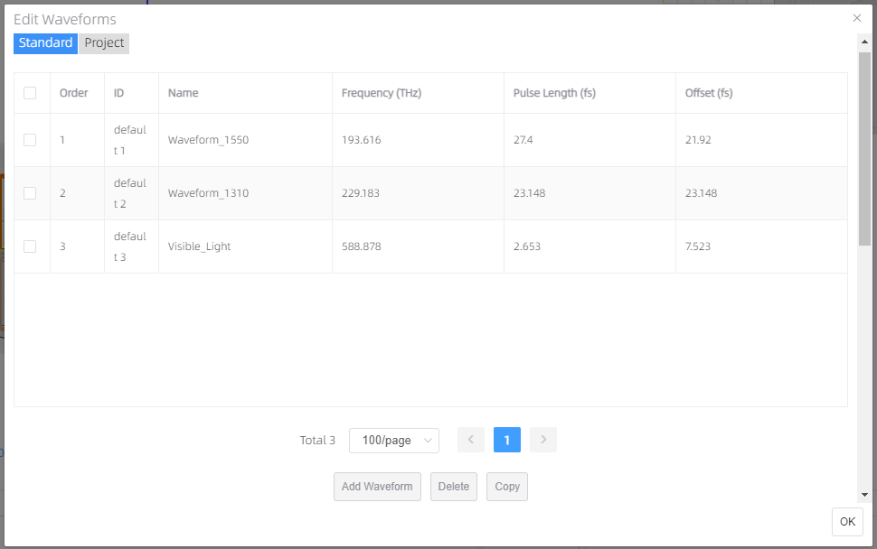
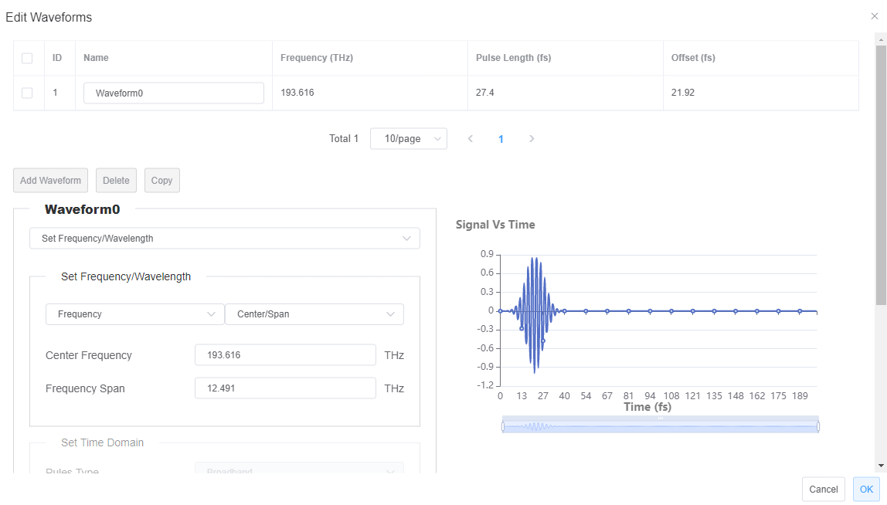

# Waveform 

Features Description: Global waveforms settings include two parts, one is standard waveform list, and another is project waveform list. There are three default materials in the standard waveform list, includes Waveform_1550, Waveform_1310 and Visible_Light. The default waveforms in the standard waveform list cannot be edited directly, user can add, or copy one of waveforms from the standard waveform list. User only can delete newly added or copied waveforms in the standard waveform list. The waveforms in the project waveform list inherit form projects built by user, user can add new waveform or delete selected waveforms in the project waveform list.

<!--  -->

1. Select one Waveform (e.g., Waveform1) in Waveform list, then edit the selected waveform in the left-down Waveforms window, at the same time, signal vs time image will display in the right-down window.

2. Signal Vs Time: The range of time can be zoom in via dragging the two ends of bottom bar.

<!--  -->

1. You can add, delete, or copy a certain waveform in the list.
2. 	You can set Frequency/wavelength or Time domain in the drop-down menu, at the same time, signal and time image will be changed as well.
3. If the “set frequency/wavelength” option was chosen, “set time domain” option will be disabled, this section makes it possible to either set the frequency or the wavelength and choose to either set the center and span or the minimum and maximum frequencies of the source.
4. For single frequency simulations, simply sets both the min and max wavelengths to the same value.
5. If the “set time domain ” option was chosen, “set frequency/wavelength” option will be disabled.
6. Broadband: The broadband source, which contains a much wider spectrum, consists of a chirped optical carrier with a Gaussian envelope. 
7. Frequency: The center frequency of the optical carrier. The value currently is default.
8. Pulse Length: The half-width at -109 dB power temporal duration of the pulse. 
9. 	Offset: The time dealy form the start of simulation to the peak of the waveform. The value currently is default.
10. Bandwidth：source band width setting.
11. Optimize for short pulse: Enabled, this is the default setting for FDTD, meaning a very short pulse will be used in most simulations.
